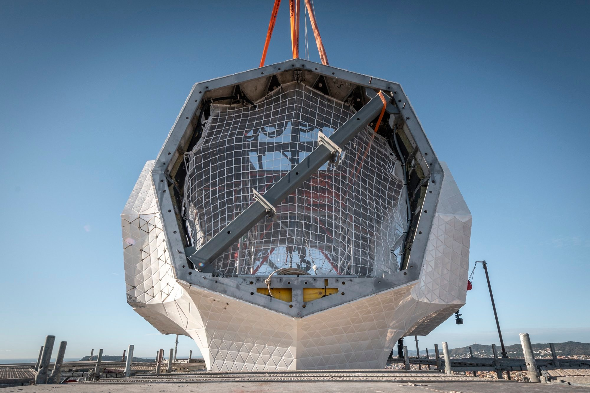
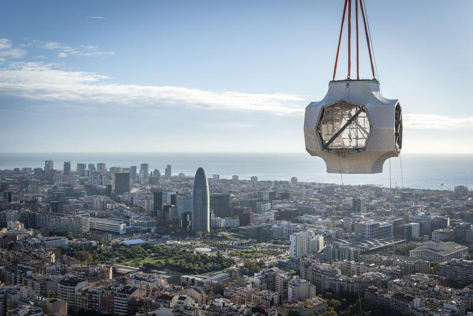
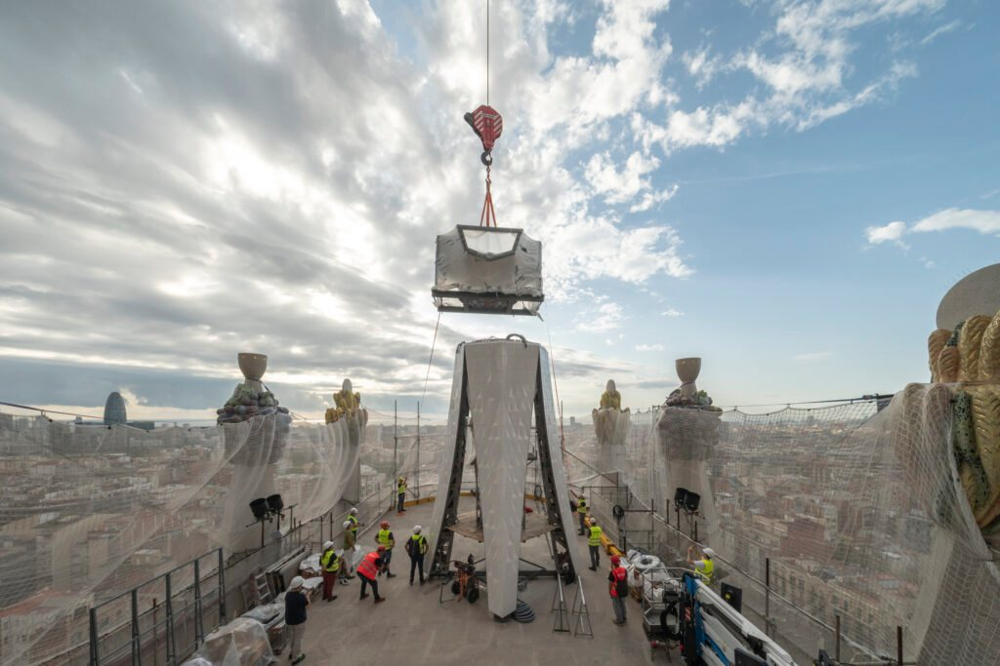
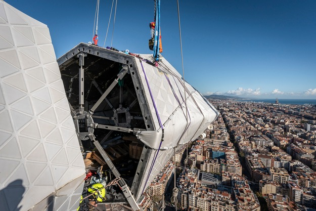

# Sagrada Família — díl III

## Technická lahůdka a nejvyšší křesťanský chrám světa

Stavba Sagrada Família se v posledních měsících dostala do fáze, kterou můžeme bez nadsázky označit za historickou.

Chrám se sice jako celek v roce 2026 ještě neuzavře, ale jeho vertikální část -- tedy všechny věže -- směřuje k dokončení právě ke 100. výročí úmrtí Antonia Gaudího.

A pozornost se dnes logicky soustřeďuje na tu nejvyšší z nich.

## Nejvyšší věž chrámu — a nejvyšší křesťanská stavba světa

Věž Ježíše Krista dosáhne po dokončení 172,5 metru a stane se tak nejvyšším křesťanským chrámem na světě, vyšším než dosavadní rekordman -- katedrála v Ulmu.

Přesto nejde o honbu za výškou. Gaudí si velmi vědomě stanovil hranici: žádné lidské dílo nesmí převýšit dílo Boží. Proto je vrchol věže o něco nižší než kopec Montjuïc, který se tyčí nad Barcelonou.

I v této technicky extrémní stavbě je tak přítomná symbolika a pokora vůči přírodě.

Z konstrukčního hlediska jde o nejzatíženější bod celého chrámu. Věž stojí nad křížením hlavní a příčné lodi a její váha -- spolu s dynamickým zatížením větrem -- se přenáší do systému masivních pilířů pod ní.

Vnitřní železobetonové jádro funguje jako vertikální páteř, zatímco kamenný a keramický plášť se aktivně podílí na stabilitě.

Věž není „pevná a nehybná" -- je navržena tak, aby se při silném větru v řádu centimetrů pružně vychylovala, podobně jako strom, a tím se chránila před nebezpečnou rezonancí.

## Technická bomba — kříž na věži Ježíše Krista

Na tuto věž se nyní instaluje kříž, který je sám o sobě technickým dílem mimořádného rozsahu.

Hotový kříž bude mít přibližně 17 metrů na výšku a 13,5 metru na šířku, tedy velikost pětipatrového domu. Je navržen jako prostorový čtyřramenný kříž, nikoli plochý symbol, a jeho celková hmotnost se odhaduje až na 100 tun.

Nejde ale o masivní blok. Konstrukce kombinuje vysoce kvalitní nerezovou ocel, ultra-vysokohodnotný beton (UHPC) a plášť z bílé glazované keramiky a skla.

Díky tomu je kříž zároveň pevný, relativně „lehčí", aerodynamicky příznivý a částečně průsvitný. Vítr jím může do určité míry procházet, což je ve výšce téměř 173 metrů klíčové.

## Jak se takový kolos instaluje

Jedním z nejzajímavějších technických detailů celé operace je samotný postup montáže. Jednotlivé díly kříže nejsou vytaženy rovnou na vrchol věže.

Nejprve jsou dopraveny na stavbu a následně vyzdviženy na pracovní platformu ve výšce 54 metrů nad hlavní lodí. Právě tam probíhá jejich předmontáž, kompletace konstrukce, zasklívání i další dokončovací práce.

Teprve hotový díl se pak v jediné, pečlivě naplánované operaci přesune na vrchol věže.

Například dolní svislé rameno kříže, dlouhé 7,25 metru a vážící 24 tun, dorazilo na stavbu už v létě, ale definitivně bylo osazeno až 30. října 2025 -- po týdnech příprav nahoře na platformě.

Následoval středový konstrukční uzel, zhruba 16,5 tuny těžký prvek, který spojuje všechna ramena. Každé z vodorovných ramen pak váží přibližně 11 tun a má složitou geometrii s jemným „twistem", typickým pro Gaudího pozdní návrhy.

Celý proces umožňují speciální věžové jeřáby s naklápěcím výložníkem, především Liebherr 710 HC-L, schopný pracovat s extrémními břemeny ve výškách přes 170 metrů.

Špička jeřábu se dostává až k hranici 200 metrů nad zemí a každé zvedání je přísně závislé na počasí -- zejména na síle a směru větru.

## Symbolika, ne konec

Pokud vše půjde podle plánu, instalace kříže bude dokončena na začátku roku 2026 a věž Ježíše Krista bude symbolicky završena právě k výročí Gaudího smrti.

Chrám jako celek ale hotový ještě nebude -- největší výzvou zůstává hlavní portál Glòria a jeho vztah k dnešní městské zástavbě. Tomuto tématu se budeme věnovat příště.

To, co dnes sledujeme na stavbě, ale není jen „pokračování stavby".

Je to završení Gaudího vertikální vize, která se po více než sto letech konečně stává skutečností.

Aktuální video ze stavby:

[**https://www.youtube.com/watch?v=RviHvwWrMw0**](https://l.facebook.com/l.php?u=https%3A%2F%2Fwww.youtube.com%2Fwatch%3Fv%3DRviHvwWrMw0%26fbclid%3DIwZXh0bgNhZW0CMTAAYnJpZBEwbGgxVkVGTjhhdDRhWEhxNHNydGMGYXBwX2lkEDIyMjAzOTE3ODgyMDA4OTIAAR7WkhlboohGKdlosFsDrim5LcXCtP8YXPP2vI7rnLEagJJeXszG6mcZphi2Qw_aem_yfNc4XDVNB-F_kL0NB2rcQ&h=AUDtIeZtgMOzOfxK-psFuV6xUsk-qW1Jc-ed8cTswEGFStHiFZ_gJQbi2kGRtQDxxCUS4fL3NdnSWtQOq-nuRSp4vp3RT-cbxvxK17bzmgB0oPmHHagA_ph_6sZXTYQRTDky-XzaY_nMNnPGRf25VCVGqqJd5w&__tn__=-UK-y-R&c%5b0%5d=AUBfUkiixXoKaFOr_uxz6CmrksebN2jgZDzdXmhaihGKvPiHoIolZA5J4YXgYKKREYF0vpSW03C05Ka6DkBUxk-hcTroNR2-tZpaO6L5RwYivZPgtjd8JSFBUw_vwfctIRC0yjm2N8XzZ9hzzVot69hG5bsovaG8C9SXQbNbTNeFm6_N6BXdPR_CWm5UyDD-pyMIl9aqB9zfUMajfX2jq3tbkDJpCfdNbHyOODv8udmwwDztsIWi00Z6QCI3iykPSLzVAXkcDu1UlVDQwFVi8tRs)

