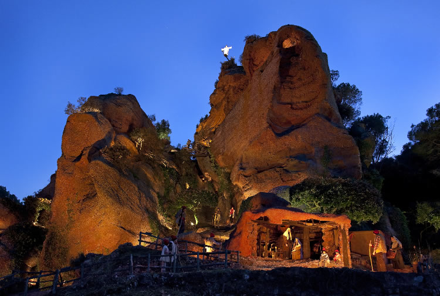

# Katalánské Vánoce II.: pragmatické, hlučné a s hlubokými tradicemi

Katalánské Vánoce nejsou rozhodně jen o jídle. Nejsou ani přehnaně zbožné, ani přehnaně sentimentální. Jsou praktické, symbolické a často překvapivě staré. Mísí se v nich křesťanství s předkřesťanskými rituály, rodinné tradice s moderním tlakem konzumu a vážné symboly s typickým katalánským humorem. Právě tahle kombinace z nich dělá Vánoce, které nejsou „na efekt", ale skutečně žité.

## Zdraví a peníze — obojí je důležité

Vánoční přání „Salut i força al canut" shrnuje katalánský pohled na svět s odzbrojující přímostí. Canut býval kožený měšec nebo rulička, kterou si lidé nosili u pasu či schovávali pod oblečením. Sloužil k ukládání mincí a drobných cenností v době, kdy kapsy neexistovaly a banky byly vzdálenou představou. Přát někomu „sílu do canutu" tedy znamenalo přát mu, aby jeho měšec byl těžký, plný a odolný -- zkrátka aby vydržel a nebyl prázdný. Vánoce byly tradičně okamžikem bilancování a přání prosperity do dalšího roku. Katalánci se nikdy netvářili, že peníze nejsou důležité. Naopak: zdraví a hmotné zajištění patří k sobě a je naprosto v pořádku to říct nahlas.

## Dárky až v lednu a čekání jako součást svátků

Hlavní katalánské rozdávání dárků přichází až 6. ledna, kdy je přinášejí Tři králové -- Els Reis Mags. Vánoce tu nejsou jedním večerem, ale dlouhým obdobím, které vrcholí až po Novém roce. Večer 5. ledna patří průvodům Cavalcada de Reis, které mají v Katalánsku masový charakter. V Barceloně se jich účastní statisíce lidí a Tři králové projíždějí městem v promyšlené choreografii (velbloudi bývají součástí průvodu celkem často). Děti píší dopisy, chystají vodu pro velbloudy a učí se čekat -- což bylo kdysi považováno za přirozenou součást výchovy. Vlivem globalizace dnes mnoho rodin přidává menší dárky už na Vánoce, ale Tři králové zůstávají symbolem skutečného konce svátků i jejich hlavního smyslu.

## Betlémy nejen jako biblická scéna, ale i mapa světa

Betlémy, katalánsky pessebres, jsou v Katalánsku všudypřítomné a často monumentální. Nejde o jednu scénu, ale o celý model světa, kde se biblický příběh odehrává uprostřed katalánské krajiny. Hory připomínají Pyreneje, domy vypadají jako místní statky, lidé pracují, perou prádlo, pasou dobytek. Betlém se během svátků postupně rozšiřuje a dolaďuje, někdy až do Tří králů. Jeho součástí je i caganer, kterého už známe. V moderních verzích se objevují i aktuální osobnosti, což ukazuje, že tradice není zkostnatělá, ale neustále reaguje na současnost.

## Když se Vánoce zapalují ohněm

V horských oblastech Pyreneje mají Vánoce zcela jinou podobu než ve městech. V obcích Bagà a Sant Julià de Cerdanyola se na Štědrý den slaví FIA-FAIA, rituál s kořeny sahajícími pravděpodobně až do předkřesťanských slunovratových obřadů. Po západu slunce se na horách zapálí oheň, z něhož se zapalují pochodně z pryskyřičného dřeva. Ty se pak snášejí do vesnice, kde s nimi lidé zapalují další ohně. Účastní se téměř všichni obyvatelé -- stovky lidí v komunitách o několika tisících obyvatel. Oheň tu není dekorací, ale symbolem ochrany, světla a kontinuity. Teprve když plameny dohoří, nastává klid, zpěv a skutečný začátek Vánoc.

Katalánské Vánoce jsou především hodně autentické. Přání plné peněženky, dárky až v lednu, betlémy jako obraz světa a ohně zapalované v horách -- to všechno ukazuje, že tradice tu nejsou muzeálním exponátem, ale živou součástí života. Katalánci Vánoce nepředstírají. Prožívají je po svém. A možná právě proto dávají tak dobrý smysl.

 

