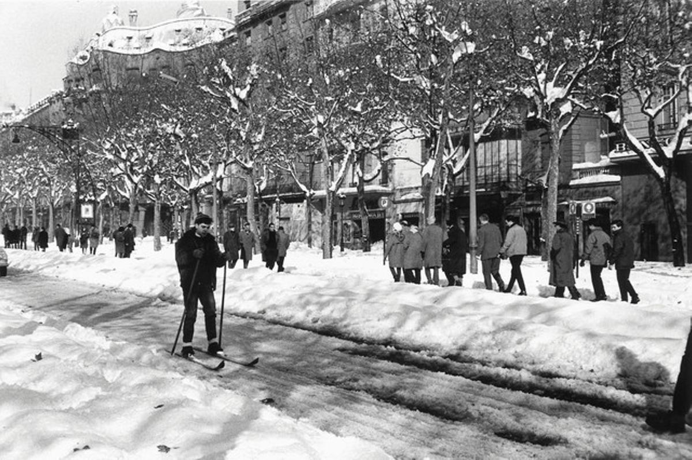
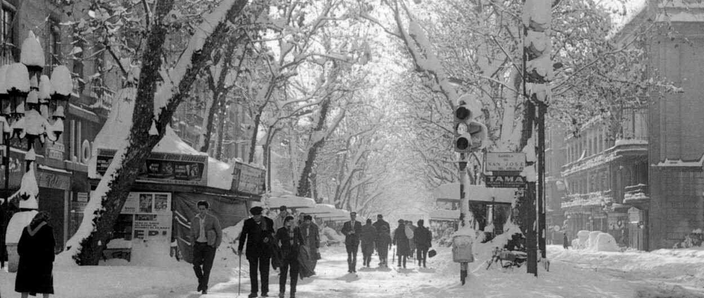
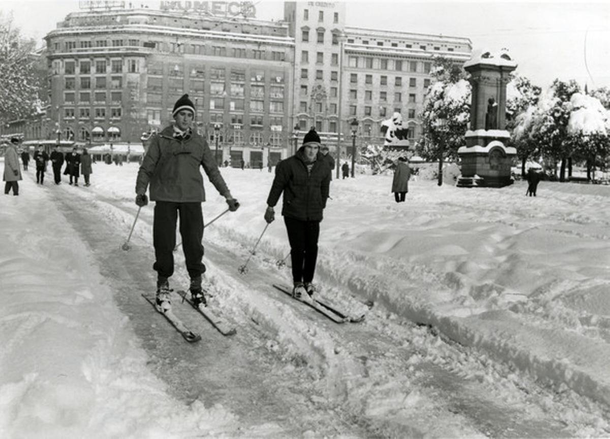
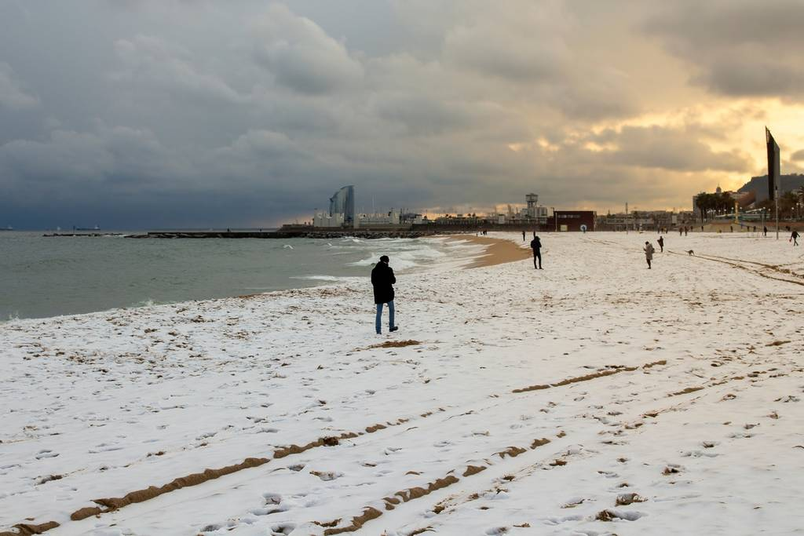

# Když v Barceloně nasněží

ACAM (Associació Catalana de Meteorologia) má krásně zpracované historické údaje: v letech 1867--1966 zaznamenali 94 „sněhových dnů", ale jen menší část z nich byla taková, že se dala měřit sněhová pokrývka -- většinou to byly jen vločky, které hned roztály, nebo „voda se sněhem".

A teď to zajímavé pro naše FOTKY Z PRVNÍ POLOVINY 20. STOLETÍ - některé zimy byly opravdu bílé:

15\. ledna 1914: ve městě se uvádí až 24 cm sněhu.

27\. února 1924: sněžení s bouřkou, až 18 cm.

15\. února 1938: opět sníh s bouřkou, kolem 13 cm.

A teď drobný detail, který na fotkách často vysvětluje, proč někde vypadá sněhu víc a někde míň: v historických záznamech se píše, že v Eixamplu se sníh držel lépe, zatímco v dlažebních/kočičích ulicích se často rychleji „rozbředl".

## Uklízení sněhu před 1962 — ale co uklízet?

To je přesně ono: protože většina sněžení nebyla taková, aby vytvořila souvislou vrstvu, město většinou nemělo důvod řešit nějakou velkou zimní logistiku. ACAM to shrnuje dost výmluvně: velká část sněhových epizod nezakryla zem a nedala se ani měřit -- tedy ani „nepáchala škody" a pro městské brigády to nebyl problém.

Jinými slovy: Barcelona historicky sníh „znala", ale většinou to nebyl sníh, kvůli kterému potřebujete pluhy.

## A pak přišly Vánoce 1962: Gran Nevada, na kterou nebyl připravený nikdo

25\. prosince 1962 napadlo v Barceloně tolik sněhu, že se město doslova zastavilo. Podle dobových zdrojů se uvádí, že na ulicích bylo až 46 cm a na Observatori Fabra na kopcích nad Barcelonou naměřili přibližně 70 cm.

A co je ještě šílenější: několik dní byla taková zima, že 25. i 26. prosince se teplota ani nedostala nad 0 °C (na Fabře), takže sníh neměl důvod tát.

A uklízení? Barcelona na to nebyla vybavená.

Záznamy popisují, že brigády se snažily sníh odstraňovat solí a lopatami, ale bylo to neúnosné -- a hlavně:

## V prosinci 1962 neměla Barcelona žádné sněhové pluhy ani techniku na úklid sněhu!

Tehdejší starosta Barcelony proto požádal o pomoc svého osobního přítele, andorrského podnikatele Andreu Claret, který se zabýval zimní údržbou komunikací. Právě on zorganizoval převoz sněhových fréz a pluhů z Andorry do Barcelony, která byla sněhem paralyzovaná. V paměti města tak zůstal jako člověk, který Barceloně pomohl zvládnout její největší sněhovou kalamitu 20. století. a z Andorry dorazily sněžné frézy a pluhy -- v Barceloně je pak lidé vítali skoro jako „osvobozovací armádu".

BYLI LIDI PŘIPRAVENÍ NA ZIMU? UPŘÍMNĚ, SPÍŠN NE (a to ani v "lepších" domech)

Tady je krásný paradox: Barcelona umí být v zimě nepříjemně studená hlavně proto, že spousta domů byla historicky stavěná spíš na léto než na mráz. A když přišly extrémy, byl to šok. ACAM například u extrémního února 1956 zmiňuje, že i „lepší" domácnosti zůstaly bez topení, protože jim mráz způsobil problémy s instalacemi (praskání potrubí apod.) -- prostě situace, se kterou se běžně nepočítalo.

## A jak se v domácnostech topilo běžně?

Ve Španělsku (včetně Katalánska) byl tradiční a velmi rozšířený zdroj tepla brasero -- ohřívadlo/žhavé uhlíky pod stolem (typicky „mesa camilla"), které zahřeje lidi kolem stolu, ale rozhodně nevytopí celý byt.

## A co poslední roky?

Filomena 2021: i když se čekalo „něco velkého", sníh Barcelonu ve finále spíš minul --- jen tiché, krátké sněžení v horních částech (Vallvidrera/Tibidabo) 8. ledna nad ránem. Barcelona tedy ostrouhala.

Únor 2023 (Juliette): na Observatori Fabra zaznamenali 3 dny po sobě se sněhem a největší pokrývka byla 27. 2. -- cca 5--6 cm na Tibidabu a až 7 cm na Fabře.

Zima 2024 Ve městě sníh nebyl, ale na plážích ho bylo celkem dost. Je to proto, že i při velmi slabém sněžení se v Barceloně může stát, že sníh zůstane viditelný na pláži. Písek není vyhřátý jako asfalt, nemá městský tepelný ostrov a nikdo ho okamžitě neodklízí ani nerozšlapává. Proto může pláž Barceloneta působit „zasněženě", zatímco ve stejnou chvíli ve městě sníh prakticky neexistuje.

NA ZÁVĚR...MINISROVNÁNÍ (kde ve Španělsku sníh vládne a kde ho skoro neznají)

„Sněhové jistoty" jsou samozřejmě hory (Pyreneje, Kantábrie...). Pro ilustraci: Puerto de Navacerrada (Sistema Central) má v normálu cca 71 sněhových dní ročně.

Naopak v nízkých polohách Kanárských ostrovů je sníh extrémní rarita; když už, týká se to spíš výšek (typicky Teide) a jde o výjimečné situace.

 

