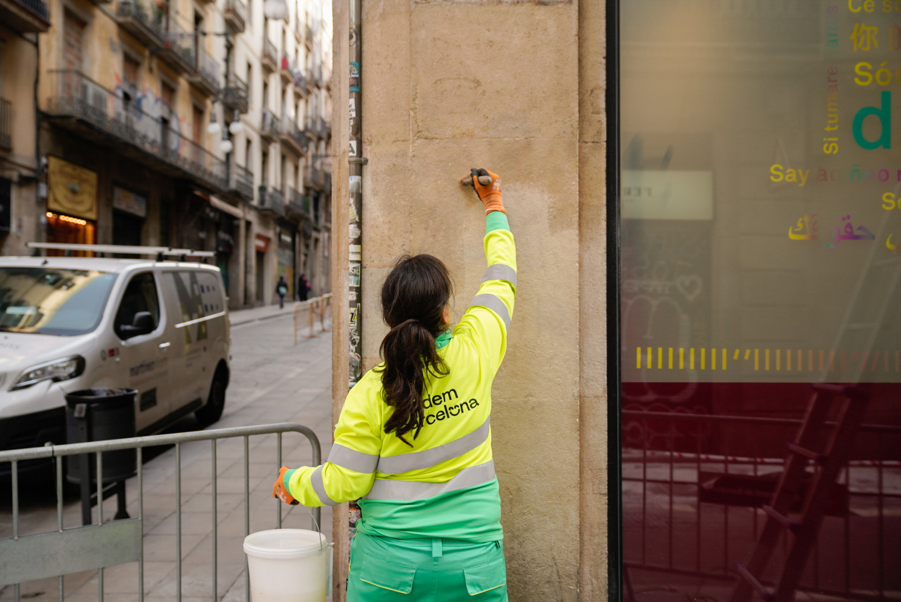
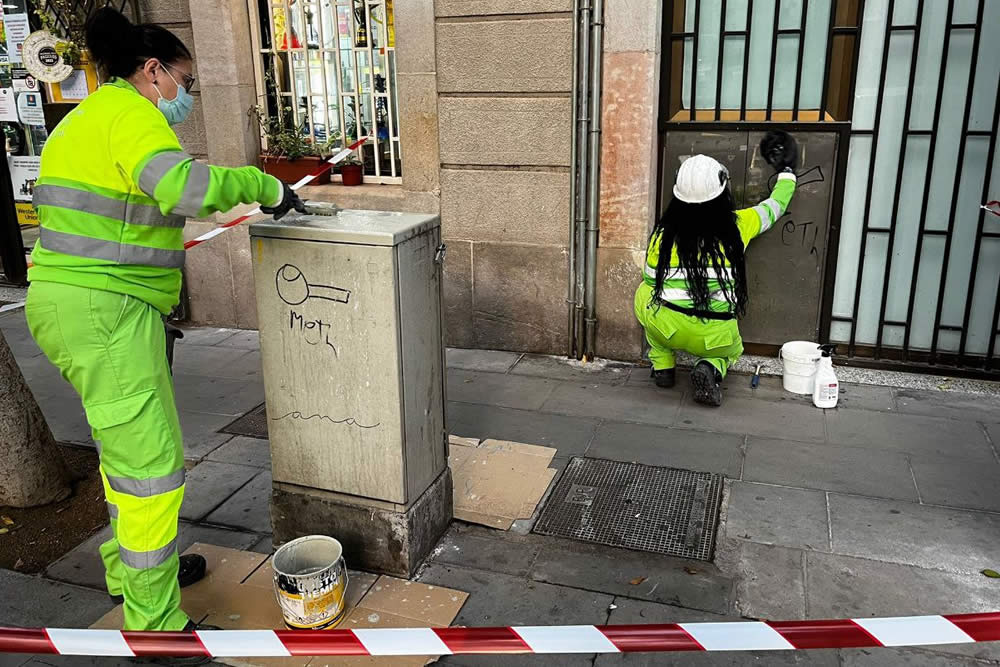
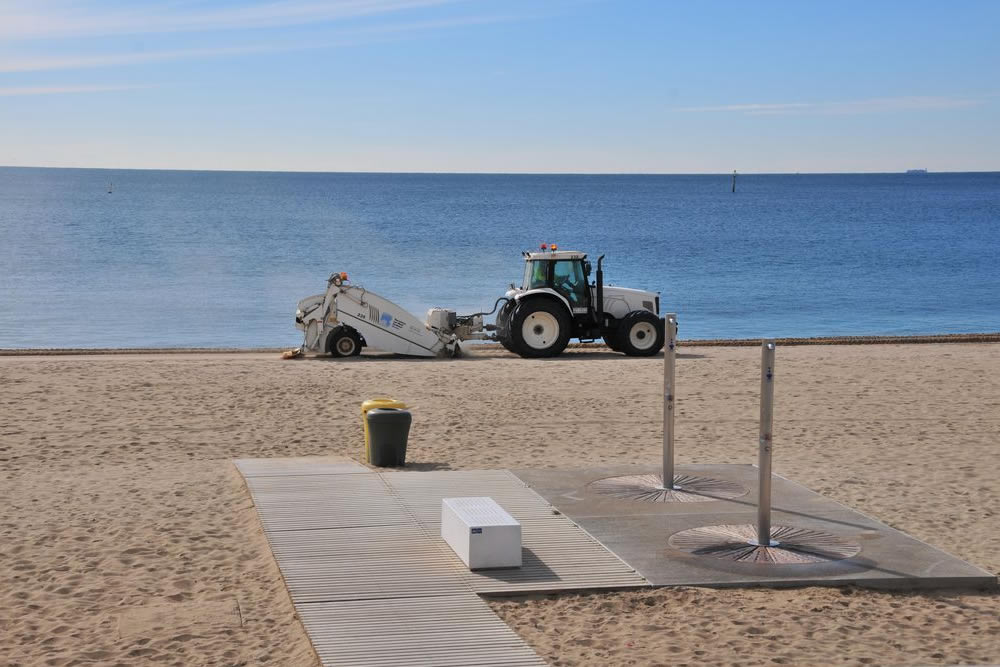
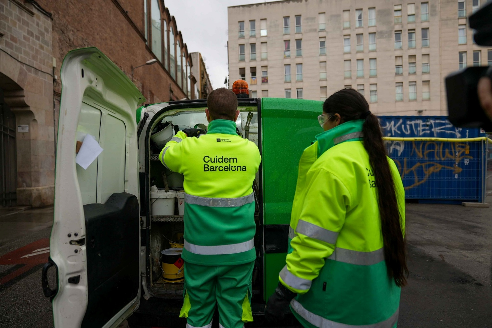
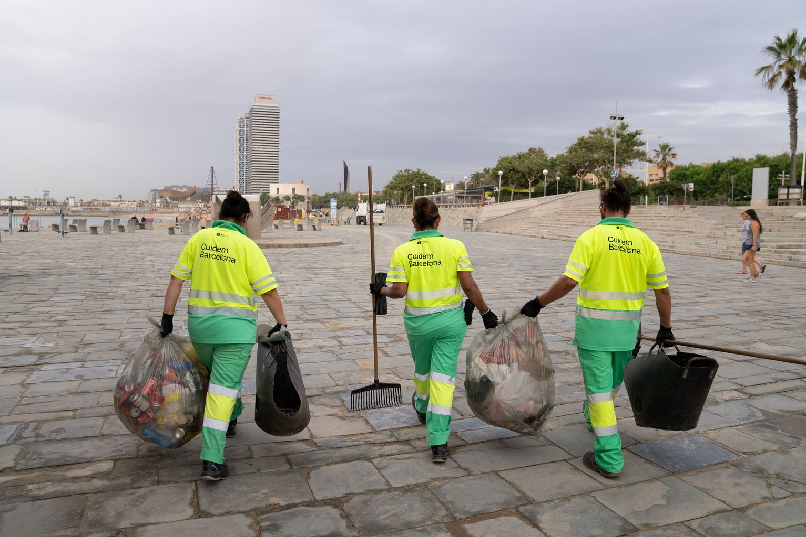
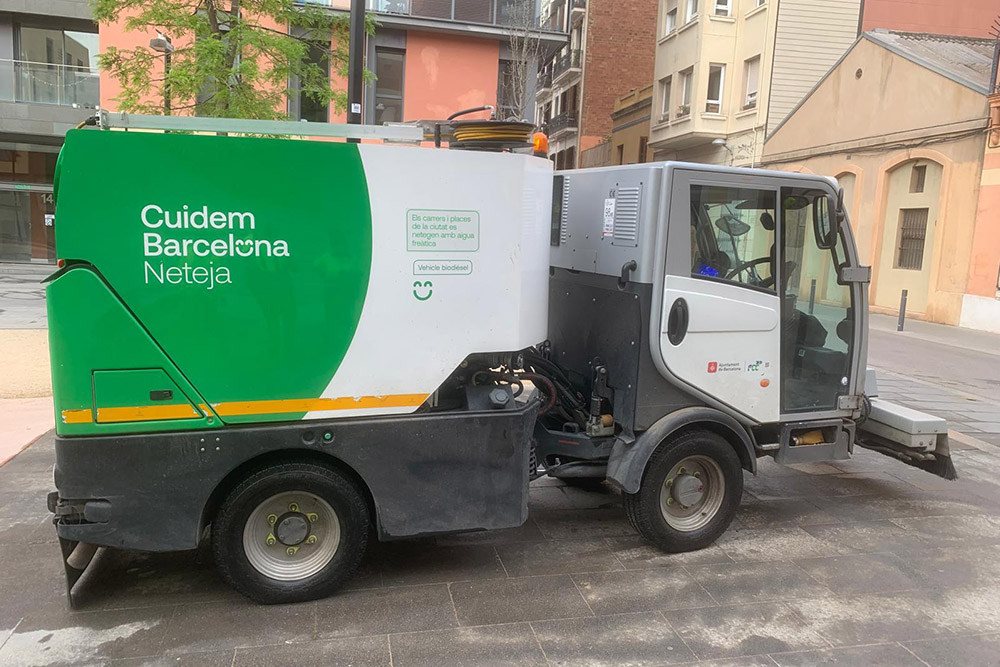

# Malý velký úklid velkého města

Když se řekne úklid města, většina lidí si představí popelářské auto nebo zametací vůz, který občas projede ulicí. Jenže v případě Barcelony (město: 1,7 milionu obyvatel; barcelonská aglomerace -- 3,4 milionu obyvatel; hustota zalidnění města 16 904,3 obyv./km² -- pro srovnání: Praha 2 817,2 obyv./km², Brno 1 751,0 obyv./km² a Plzeň 1 364,8 obyv./km²) je to ve skutečnosti OBROVSKÝ, A HODNĚ DOBŘE ŘÍZENÝ SYSTÉM.

Barcelona má nově na úklid ulic a svoz odpadu největší městský kontrakt, jaký kdy uzavřela. Ročně na něj jde téměř 300 milionů eur a za celé období 2022--2030 víc než 2,3 miliardy eur.

V tomhle balíku je úplně všechno: úklid ulic, svoz komunálního odpadu, kontejnery (jejich mytí, údržba i výměna), úklid pláží, technika, vozový park, zaměstnanci i řízení celého systému v jednotlivých částech města. Zkrátka všechno, co běžně vnímáme jako „město se uklízí".

Tenhle obří systém drží v chodu zhruba 4 400 PRACOVNÍKŮ A PRACOVNIC Nejsou to městští úředníci, ale zaměstnanci soukromých firem, které mají s městem DLOUHODOBOU PRACOVNÍ SMLOUVU NA 8 LET. A právě to je ve Španělsku klíčové. V zemi, kde je běžná pracovní smlouva na tři nebo šest měsíců, znamená stabilní kontrakt, kolektivní smlouva, sociální a zdravotní pojištění obrovskou jistotu.

Možná jste si všimli, že v ulicích dnes pracuje hodně mladých lidí. Není to náhoda. Nezaměstnanost mladých je ve Španělsku dlouhodobě vysoká, hlavně u lidí bez vysokoškolského vzdělání. Mnozí už nechtějí nebo nemohou pracovat v turistice -- kvůli sezónnosti, večerům, víkendům a nejistotě. Práce v technických službách je fyzicky náročná, ale časově předvídatelná, legální a stabilní. PRO HODNĚ MLADÝCH Španělů je to REÁLNÝ SOCIÁLNÍ VZESTUP, ne selhání.

Navíc město i dodavatelské firmy cíleně podporují GENERAČNÍ OBMĚNU.

Starší zaměstnanci odcházejí do důchodu, přichází nové technologie, elektrická vozidla a digitální plánování tras. Kontrakty mají i silný sociální rozměr -- počítají se zapojením lidí bez kvalifikace, se zdravotním omezením nebo z rizikového sociálního prostředí. Úklid města tu není jen o čistotě, ale i o sociální soudržnosti.

Velkou změnou posledních let je TECHNIKA.

Barcelona dnes provozuje přibližně 870 vozidel, z nichž 66 % je elektrických (ještě nedávno to bylo kolem 20 %). Důvodem jsou emise, hluk a možnost pracovat v noci. Právě ta „malá cool autíčka", která potkáte v gotických uličkách nebo na pěších zónách, jsou kompaktní elektrické zametací stroje navržené přesně pro historické centrum -- tiché, obratné a bez výfukových plynů. Na širších třídách pak pracují větší zametací vozy a mycí auta s vysokotlakou vodou. Některé stroje jsou multifunkční: zvládnou zametat, sbírat odpad i mýt povrch během jedné trasy.

Důležitým tématem je i voda. Město stále víc využívá podzemní (freatickou) vodu k mytí ulic tam, kde je to možné, což je zásadní v době sucha a omezení spotřeby pitné vody.

Možná jste si také všimli, že se Barcelona uklízí hlavně VEČER A V NOCI .

Není to náhoda. V turisticky nejvytíženějších místech -- v centru, na Ramblách, u pláží -- by denní úklid znamenal neustálé konflikty s chodci, auty a provozem. Noční úklid umožňuje městu fungovat přes den a každé ráno se tak trochu „resetovat". Bez elektrických a tišších strojů by to přitom nebylo možné.

Velkou pozornost město věnuje i KONTEJNERŮM, protože právě jejich okolí lidé vnímají nejcitlivěji. Vnitřky kontejnerů se v sezóně myjí týdně, mimo sezónu jednou za čtrnáct dní. Vnější části se čistí jednou za 15 dní, případně jednou měsíčně. Novinkou je i hloubkové mytí prostoru pod kontejnery pomocí speciálních strojů, které je dokážou nadzvednout.

Celý systém organizačně řídí město, ale samotnou službu zajišťují různé firmy podle jednotlivých městských zón -- centrum, západ, sever a východ Barcelony. Město si zároveň ponechává silnou kontrolu nad daty, kvalitou i sankcemi, aby mělo systém víc „ve vlastních rukou".

A přesto všechno zůstávají výzvy. Extrémní turistická zátěž v některých místech, delší a horká léta, třídění odpadu, které je stále pod cíli EU, i každodenní chování lidí -- nedopalky, kelímky, psí exkrementy. Technika dokáže hodně, ale ne všechno.

Barcelona se neuklízí proto, aby byla hezká. Uklízí se v noci, aby přes den mohla fungovat. A to, že ráno město většinou vypadá relativně čistě, není samozřejmost -- ale výsledek obrovské, každodenní, často neviditelné práce.

¨

 

