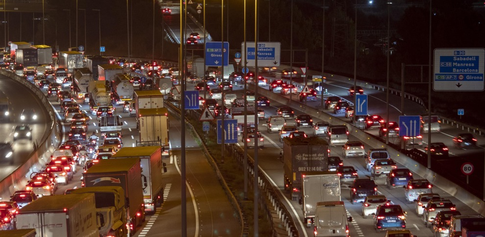

# Proč Barcelona funguje (i s auty)

*aneb když urbanismus předběhne dobu*

Pamatuji si 90. a nultá léta, kdy jsem v Barceloně žila. A pamatuji si i jedno nepsané pravidlo: pokud jsem do hodiny nenašla parkování v okruhu zhruba jednoho kilometru od domu, vzdala jsem to, zaparkovala jsem kde to šlo a dojela domů MHD. Jinak bych klidně projížděla městem do rána.

Parkovalo se „na sluch". Doslova. Mezi auty byly někdy jen centimetry -- vpředu i vzadu. Všichni takhle parkovali a člověk se to prostě musel naučit. Já se díky tomu naučila parkovat opravdu přesně (chlapi mi to často záviděli ). Ale ono to jinak ani nešlo.

A pak tu byly víkendy. V noci z pátku na sobotu a ze soboty na neděli, mezi půlnocí a druhou ráno, řídila policie dopravu na hlavních tazích -- na Aragó, Gran Vía nebo Diagonal. Barcelona žila, auta stála a provoz byl tak hustý, že bez policistů by se město nehýbalo.

Kolony na barcelonských okruzích byly tak dlouhé, že se v nich lidé seznamovali. Řidiči v sousedních pruzích si z okýnek ukazovali na prstech telefonní čísla a pak si psali. Stalo se to i mně. Nebyla to výjimka -- byl to stav.

A právě proto mě dnes fascinuje pravý opak: plynulost. Klid. Minimum troubení. A otázka, která se nabízí sama:

Jak je možné, že tak velké město dnes funguje úplně jinak?

## Město, které nedýchalo

Ještě v polovině 19. století byla Barcelona sevřená hradbami. Uvnitř nich žilo na relativně malém prostoru přes 150 000 obyvatel. Úzké ulice, špatná kanalizace, minimum světla a vzduchu. Nemoci se šířily rychle, požáry bylo téměř nemožné hasit -- do některých míst se prostě nedalo dostat.

Město opakovaně zasáhly epidemie žluté zimnice a cholery, které si vyžádaly tisíce obětí. Hradby, které měly Barcelonu chránit, se staly pastí. Zároveň kolem města existovalo bezzástavbové obranné pásmo, takže Barcelona nemohla růst postupně. Vedle ní sice existovaly samostatné obce -- Gràcia, Sants, Sant Martí --, ale město samo bylo doslova zablokované.

## Zlom: když hradby padly

V roce 1854 padlo rozhodnutí hradby zbourat. Nebyl to estetický rozmar, ale nutnost. Barcelona se mohla poprvé nadechnout -- a bylo jasné, že nový kus města musí vzniknout jinak než ten starý.

## Plan Cerdà a Eixample: město myšlené dopředu

Inženýr Ildefons Cerdà navrhl nový městský celek, který dostal název Eixample -- „rozšíření". Ne náhodou. Nešlo o přilepení další čtvrti, ale o zcela nový koncept města.

Ulice jsou uspořádány do šachovnice tak, že se pravidelně střídají směry:

jedna ulice směřuje k horám, další k moři; jedna na sever, další na jih. Díky tomu je orientace ve městě překvapivě jednoduchá -- když netrefíte správnou ulici, na první křižovatce to snadno opravíte. To je dodnes obrovská výhoda pro pohyb i dopravu.

Základní jednotkou se staly manzanas -- městské bloky s regulovanou výškou domů a původně otevřenými vnitrobloky se zelení. Cerdà chtěl světlo, vzduch a kvalitu života pro všechny, ne jen pro vyvolené. Byl to sociální projekt, ne developerský.

Realita se časem změnila: domy vyrostly výš, vnitrobloky se často zastavěly. Přesto -- a to je fascinující -- ten plán funguje dodnes.

A typické zkosené rohy domů? Nejde o designový rozmar. Umožňují lepší rozhled, víc světla a plynulejší provoz. Dnes navíc slouží jako prostor pro parkování, stromy, kavárny a život na křižovatkách. Technické řešení, které se proměnilo v kvalitu veřejného prostoru.

## Město s auty, ale ne pod auty

Cerdà plánoval město v době, kdy auta neexistovala. Přesto jeho struktura unesla jejich masový nástup. Široké třídy jako Gran Via, Aragó, Passeig de Gràcia nebo Diagonal, ale i běžné ulice Eixamplu dnes zvládají koexistenci aut, MHD, cyklistů, chodců -- a pořád zůstává místo pro lidi.

Podle oficiálních dat města Barcelony počet osobních aut v posledních letech mírně klesá. Zatímco kolem roku 2020 bylo v Barceloně evidováno přibližně 480 000 osobních aut, v roce 2024 už zhruba 468 000. Nejde o město bez aut -- ale o město, kde auta přestala dominovat.

I proto dnes většina mých barcelonských přátel auto vůbec nemá. Ne proto, že by nemohli. Ale proto, že ho nepotřebují.

## Co to znamená dnes

Barcelona není dokonalá. Řeší turistiku, zásobování, logistiku. Ale díky struktuře, kterou dostala už v 19. století, neřeší kolaps. Město se nepřizpůsobilo autům. Auta se přizpůsobila městu.

## Malé srovnání na závěr

Když se dnes Barcelona srovná s jinými evropskými městy, překvapí jedno číslo: osobních aut na obyvatele je tu výrazně méně než třeba v Praze.

Zatímco Praha se dlouhodobě pohybuje kolem 700--750 osobních aut na 1 000 obyvatel, Barcelona je zhruba na polovině tohoto čísla -- a trend jde spíš dolů než nahoru.

