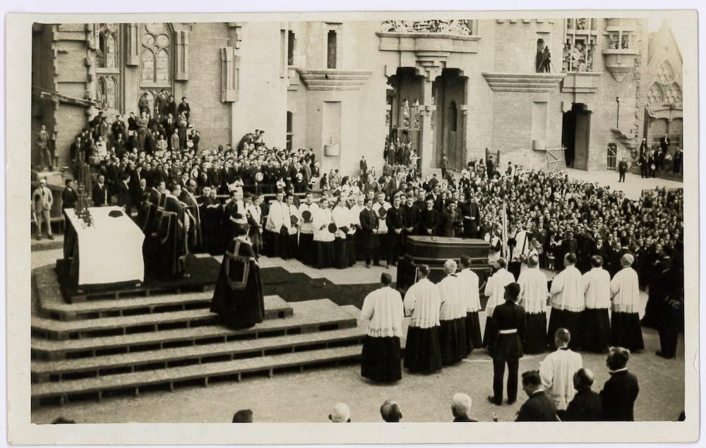

# Střípky ze života Antoni Gaudího

*Dnes, 10. června 2026, je to právě 100 let od smrti Antoni Gaudího. Známe jeho stavby. O samotném Gaudím toho víme překvapivě málo. Zde je to, co se mi podařilo najít o soukromém životě barcelonského génia.*

Jeho život byl stejně neobyčejný jako jeho architektura: nikdy se neoženil. Neměl děti. Na konci života žil téměř jako mnich. Když zemřel, považovali ho kolemjdoucí za obyčejného žebráka. O několik dní později se s ním přišlo rozloučit kolem třiceti tisíc lidí.

## Gaudí a ženy

Antoni Gaudí se nikdy neoženil a neměl žádné děti.

Podle historiků existovala pouze jedna žena, kterou skutečně miloval – Josefa „Pepeta" Moreu, učitelka z Mataró. Gaudí ji hluboce obdivoval a nakonec ji požádal o ruku. Pepeta ho však odmítla. Ne proto, že by si ho nevážila, ale údajně proto, že si nedokázala představit společný život s člověkem, který byl zcela pohlcen svou prací.

Gaudí byl známý svou roztržitostí, nepraktickou povahou a absolutním soustředěním na architekturu. Pepeta si zřejmě představovala jiný typ manžela. Odmítnutí ho zasáhlo mnohem více, než dával najevo.

Pepeta se později několikrát provdala, zatímco Gaudí už nikdy žádný vážný vztah nenavázal.

Někteří životopisci se domnívají, že právě tato zkušenost přispěla k jeho postupnému odklonu od společenského života a k hlubší religiozitě.

## Mládí

Dnes si Gaudího často představujeme jako podivínského starce, který žije pouze pro Sagradu Famílii.

Ve skutečnosti byl v mládí úplně jiný.

Navštěvoval kavárny, divadla, zajímal se o politiku, literaturu i kulturní dění. Patřil ke generaci mladých katalánských intelektuálů, kteří chtěli modernizovat Katalánsko.

Teprve postupně se začal uzavírat do sebe. Velký vliv měly osobní tragédie. Zemřela mu matka, později bratr Francesc, následně neteř Rosa, o kterou se staral. Postupně přišel téměř o všechny nejbližší příbuzné.

Na sklonku života zůstal prakticky sám.

## Když ještě bydlel v Parku Güell

Málokdo ví, že Gaudí téměř dvacet let bydlel v domě v Parku Güell.

Dnes zde sídlí Gaudího muzeum.

Do domu se nastěhoval v roce 1906 a žil zde až do konce roku 1925. Každé ráno odcházel pěšky na stavbu Sagrady Famílie a večer se vracel zpět.

Dnes je to přibližně tři kilometry. Je však třeba si uvědomit, že tehdejší Park Güell stál téměř na okraji Barcelony. Gaudí denně scházel z kopce do města a večer absolvoval stejnou trasu opačným směrem. Dělal to i po sedmdesátce. Téměř dvacet let. Tato každodenní cesta dokonale vystihuje jeho disciplinovaný způsob života.

Na konci roku 1925 se přestěhoval přímo do malé dílny vedle Sagrady Famílie. Chtěl být svému životnímu dílu co nejblíž.

## Rivalové, nebo kolegové

Když se mluví o katalánském modernismu, obvykle se zmiňují tři velká jména:

- Antoni Gaudí
- Lluís Domènech i Montaner
- Josep Puig i Cadafalch

Často se tvrdí, že mezi nimi panovala silná rivalita. Skutečnost byla složitější.

Domènech i Montaner byl dokonce jedním z Gaudího profesorů na škole architektury. Přestože měli odlišné názory na architekturu, navzájem se respektovali. Gaudí se dokonce účastnil jeho pohřbu.

Také vztah s Puigem i Cadafalchem byl spíše profesionální konkurencí než osobním nepřátelstvím. Každý z nich představoval jinou tvář katalánského modernismu. Domènech byl intelektuál, Puig historik a politik, Gaudí vizionář a experimentátor.

Dnes jsou všichni tři považováni za velikány, kteří společně vytvořili architektonickou identitu moderní Barcelony.

## Mnišský život

Posledních asi dvanáct let života se Gaudí věnoval výhradně Sagradě Famílii. Přestal přijímat nové zakázky. Nosil staré obnošené oblečení. Jedl velmi skromně. Většinu času trávil mezi dělníky na stavbě.

Mnoho současníků později vzpomínalo, že vypadal spíše jako chudý mnich než jako nejslavnější architekt Španělska. Veškerou energii věnoval jedinému cíli – dokončení chrámu.

Když se ho někdo ptal, proč práce postupují tak pomalu, odpovídal: „Můj klient nespěchá." Myslel tím Boha.

## Dny před smrtí

Dne 7. června 1926 se vydal jako každý den do kostela Sant Felip Neri na modlitbu a zpověď.

Při přecházení Gran Via de les Corts Catalanes ho srazila tramvaj. Utrpěl vážná zranění a ztratil vědomí. Nikdo však netušil, koho mají před sebou. Sedmdesátitříletý muž byl oblečený ve starém ošuntělém kabátu, neměl u sebe doklady a vypadal jako chudák z ulice.

Několik taxikářů údajně odmítlo odvézt „žebráka" do nemocnice. Nakonec byl převezen do nemocnice Santa Creu, kde byl přijat jako neznámý chudý muž. Teprve následující den se zjistilo, že jde o nejslavnějšího architekta země.

Přátelé mu nabízeli převoz do lepší nemocnice. Gaudí odmítl. Podle svědectví pronesl větu: „Mé místo je zde mezi chudými."

Dne 10. června 1926 zemřel. Bylo mu 73 let.

## Pohřeb, který zastavil celé město

Pohřeb se konal 12. června 1926.

To, co následovalo, překvapilo celé město: Barcelona se prakticky zastavila. Podél trasy pohřebního průvodu se shromáždily desetitisíce lidí. Obchody zavíraly, zvonily kostelní zvony a davy lemovaly ulice. Podle dobových zpráv se přišlo rozloučit přibližně 30 000 lidí.

Průvod procházel historickým centrem města a zastavil se na místech spojených s jeho životem a dílem.

Muž, kterého o několik dní dříve považovali za bezdomovce, byl nyní vyprovázen jako národní osobnost.

## Kde je pohřbený

Gaudí je pohřben v kryptě Sagrady Famílie, v kapli Panny Marie Karmelské. Jen málokterému architektovi se dostalo takové pocty.

Odpočívá uvnitř stavby, které zasvětil poslední desetiletí svého života.

## Co po něm zůstalo

Neměl ženu ani děti.

Jeho dědictvím jsou jeho stavby:

- Sagrada Família
- Park Güell
- Casa Batlló
- Casa Milà (La Pedrera)
- Casa Vicens
- Palau Güell
- Colònia Güell

a mnoho dalších.

V roce 2025 uznal Vatikán jeho „hrdinské ctnosti" a udělil mu titul Ctihodný. Jde o významný krok na cestě k případnému blahořečení.

Gaudí tak možná jednou vstoupí do dějin nejen jako geniální architekt, ale také jako člověk mimořádné víry.

Jeho život je plný paradoxů. Nikdy nezaložil rodinu, ale vytvořil dílo, které obdivuje celý svět.

Zemřel téměř anonymně jako chudý muž na ulici, ale na jeho pohřeb přišla celá Barcelona.

A stavba, kterou považoval za nedokončenou, se stala jedním z nejslavnějších symbolů lidstva.
