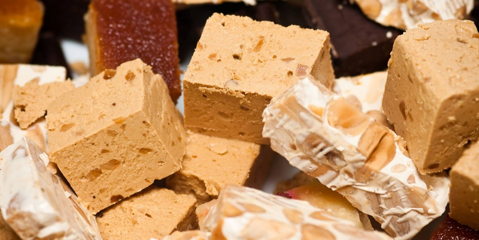
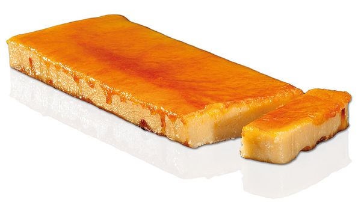

# Vánoce v Barceloně

*aneb katalánské Vánoce na talíři*

Po letech strávených v Katalánsku člověk pochopí, že místní Vánoce se odehrávají hlavně u stolu. Nejde o to, kolik kdo upeče druhů cukroví, ale jak dlouho se u jídla sedí a s kým.

Katalánské vánoční menu má jasná pravidla, která se příliš nemění. A právě díky tomu funguje už po staletí.

Je ale i důkazem, že tradice se dají udržovat i bez stresu a nekonečného pečení. Stačí vědět, co má na vánočním stole skutečně své místo. Katalánské ženy totiž nemusí péct žádné cukroví -- a vůbec jim to nevadí.

Vánoční stoly ovládají TORRONS, sladkost, která má blíž ke středověku než ke kuchařce našich babiček.

Základní recept je jednoduchý a přitom geniální: mandle, med, cukr a bílek.

Historicky torrons pocházejí z oblasti Středomoří a jejich výroba je spojována s arabským vlivem ve středověkém Španělsku.

Nejslavnější jsou varianty Jijona (měkký, krémový) a Alicante (tvrdý s celými mandlemi), ale v Katalánsku se vyrábějí i místní verze, například v Agramuntu.

Dnes existují torrons s čokoládou, pistáciemi, alkoholem nebo dokonce se solí -- tradice se tu rozhodně nebojí inovací.

Zatímco sladké se jí celé svátky, hlavním jídlem Štědrého dne je ESCUDELLA I CARN D´OLLA.

Jde o sytou polévku, která připomíná naši silnou vývarovou klasiku, ale v katalánském měřítku. Největší pozornost budí GALETS -- obří mušlovité těstoviny, do kterých by se klidně vešla polovina lžíce.

Vývar se vaří z několika druhů masa, zeleniny a klobás a má zasytit celou rodinu na dlouhé hodiny.

Nejde o lehké jídlo, ale o symbol hojnosti a společného stolování.

Sladký vrchol Vánoc ale přichází až se svátkem Tří králů v podobě ROSCÓ DE REIS.

Je to kruhový koláč je zdobený kandovaným ovocem a uvnitř skrývá dvě překvapení.

Figurka znamená, že se stáváte králem dne, fazole naopak rozhoduje o tom, kdo zaplatí koláč příště.

A ne, na věk ani výmluvy se nehraje:-)

 
