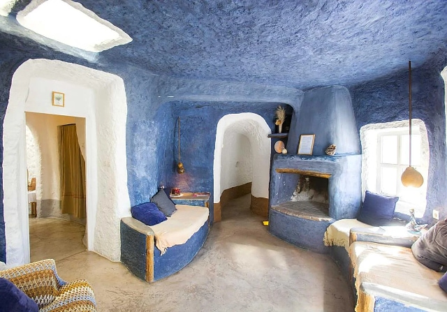
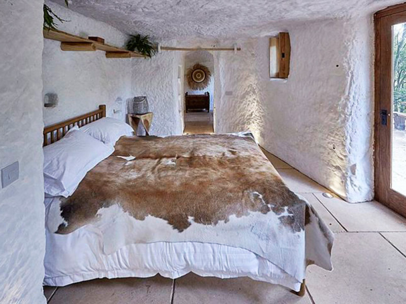

# Chtěli byste žít v jeskyni?

Představte si, že venku panují letní vedra přes 40 °C, ale vy doma
nepotřebujete klimatizaci. V zimě zase netopíte – a přesto je uvnitř
příjemných 18 až 20 stupňů. Nejde o futuristický ekologický projekt, ale
o několik století starý způsob bydlení, který dodnes funguje v jižním
Španělsku.

V andaluské vesnici Zújar v provincii Granada lidé stále žijí v tzv.
*casas cueva* – jeskynních domech vyhloubených do skály. A překvapivě
nejde jen o turistickou atrakci. Pro mnoho obyvatel jsou tyto domy
běžným, pohodlným a velmi levným způsobem života.

Jeskynní obydlí mají v Andalusii dlouhou tradici. Nejvíce se vyskytují v
oblasti kolem měst Guadix, Baza nebo právě Zújaru. Díky specifickému
složení půdy a měkké hornině bylo možné domy jednoduše vyhloubit přímo
do kopců.

Na první pohled často vypadají nenápadně – zvenku je vidět jen bílá
fasáda s dveřmi a komínem. Skutečný prostor se ale skrývá uvnitř hory.
Právě skála je tajemstvím jejich mimořádné energetické úspornosti.

## Přirozená klimatizace zdarma

Jeskynní domy fungují jako dokonalý přírodní izolant. Zemina kolem domu
udržuje stabilní teplotu po celý rok – většinou mezi 18 až 20 °C.

V létě je uvnitř příjemný chládek, zatímco venku spalující vedro. V zimě
naopak teplota neklesá tak drasticky jako v běžných domech.

Výsledek? Téměř nulové náklady na klimatizaci, minimální potřeba
vytápění, nízké účty za energie a velmi příjemné mikroklima. V době
drahých energií působí něco tak jednoduchého až neuvěřitelně moderně.

## Jeskyně s Wi-Fi a moderní kuchyní

Přestože jde o tradiční způsob bydlení, dnešní *casas cueva* rozhodně
nepřipomínají pravěké jeskyně.

Mnohé domy jsou kompletně zrekonstruované a mají moderní koupelny,
vybavené kuchyně, internet, krby, terasy s výhledem na hory a často i
bazén.

Uvnitř bývá překvapivé ticho. Silné stěny tlumí hluk zvenčí a mnoho lidí
popisuje bydlení v jeskyni jako mimořádně klidné a útulné.

## Kolik stojí život v jeskyni?

A teď přichází ŠOK.

V oblasti Zújaru lze stále najít obyvatelné jeskynní domy kolem 20 000
€. Menší zrekonstruované domy se často pohybují mezi 25–40 tisíci eur
podle velikosti a stavu. Luxusnější turistické objekty jsou samozřejmě
dražší.

Ceny jsou ale stále nesrovnatelně nižší než ve většině Evropy. To je
jeden z důvodů, proč se o tuto oblast začínají zajímat cizinci hledající
levnější a klidnější život ve Španělsku.

## Dá se tam pracovat?

Zújar je malá obec s několika tisíci obyvateli, takže pracovní možnosti
nejsou tak široké jako ve velkých městech. Přesto existuje několik
směrů:

### Turismus

Právě jeskynní domy lákají stále více turistů. Lidé zde pracují v malých
penzionech a ubytováních, v restauracích, jako správci turistických
objektů nebo pronajímají vlastní *casas cueva* přes Airbnb.

### Práce na dálku

Pro digitální nomády může být oblast velmi zajímavá. Nabízí nízké
životní náklady, klid, slunečné počasí a stabilní internet v mnoha
domech.

### Zemědělství a lokální služby

Okolí je zemědělská oblast. Pěstují se olivy, mandloně nebo obilí. Část
místních pracuje v zemědělství, stavebnictví nebo službách.

### Lázně a přírodní turismus

Nedaleko se nachází termální lázně Baños de Zújar a obrovská vodní nádrž
Embalse del Negratín, která přitahuje návštěvníky kvůli koupání, kajakům
nebo turistice.

## Romantika… ale ne pro každého

Život v jeskyni zní romanticky – a pro mnoho lidí opravdu je. Klid,
minimum stresu, pomalé tempo života a téměř nulové účty za energie mají
obrovské kouzlo.

Na druhou stranu je potřeba počítat i s realitou: oblast je poměrně
odlehlá, bez auta se člověk prakticky neobejde, pracovní nabídka je
omezená a ne každý si zvykne na život v malé andaluské komunitě.

Přesto počet lidí, kteří hledají alternativu k drahému a hektickému
životu ve městech, roste.

Zújar leží v provincii Granada v Andalusii, poblíž pohoří Sierra de Baza
a jezera Negratín. Oblast je známá vysokým počtem tradičních jeskynních
obydlí a velmi horkým klimatem v létě.

