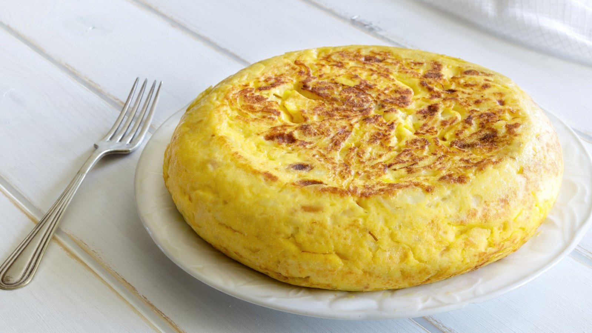
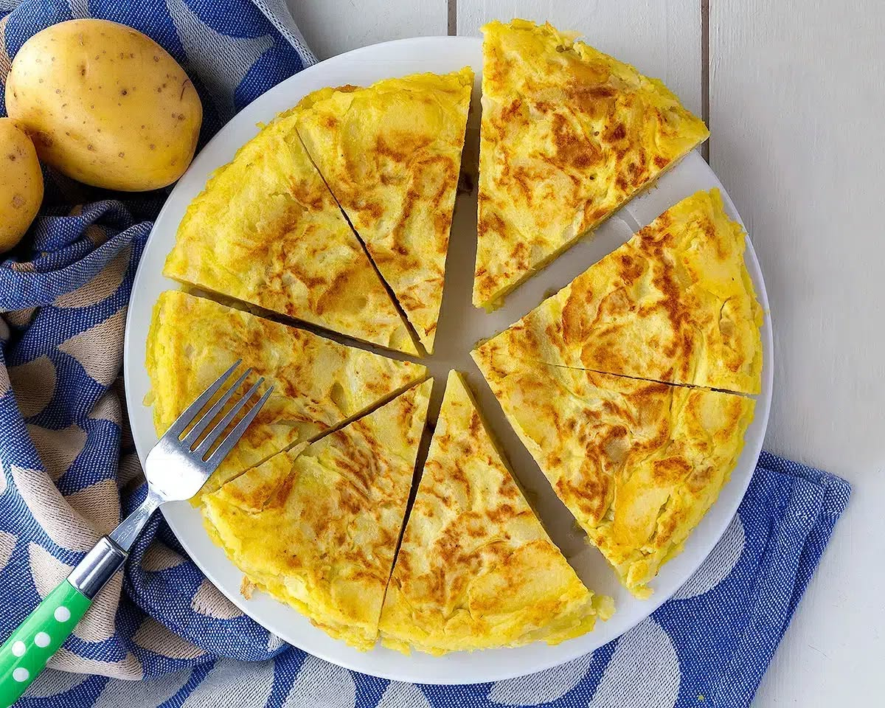

# Tortilla de Patatas

I španělská společnost je těžce rozdělená na dva nesmiřitelné tábory: tortilla **s** nebo **bez** cibule? Toť zásadní otázka každého pořádného Španěla.

Já mám radši tu s cibulí, protože v tortille je neskutečně jemná a sladká. Ale přenesu přes srdce i to, když si někdo dovolí ji nepřidat. 😃

## Suroviny (4 porce)

- 5–6 větších brambor
- 1 střední cibule (volitelná… ale víme své 😉)
- 6 vajec
- kvalitní olivový olej
- sůl

## Postup

1. Brambory oloupejte a nakrájejte na tenké plátky nebo půlkolečka. Ne na kostky — tortilla má být jemná.
2. Na pánvi rozehřejte dostatek olivového oleje a brambory smažte pomalu, na středním až mírném ohni. Nemají křupat, mají změknout a lehce se „konfitovat".
3. Pokud jste tým „s cibulí", přidejte ji nakrájenou na tenké proužky zhruba v polovině smažení a nechte zesládnout.
4. Hotové brambory (a cibuli) sceďte — olej si klidně schovejte na další vaření.
5. V míse rozšlehejte vejce se solí a ještě teplé brambory do nich vmíchejte. Nechte pár minut odpočinout, aby se chutě propojily.
6. Směs vlijte na lehce vymazanou pánev a opékejte několik minut z jedné strany.
7. Pomocí talíře tortillu obraťte a dopečte z druhé strany.

Uvnitř může zůstat lehce vláčná — tak ji mají rádi mnozí Španělé. Pokud preferujete pevnější, nechte ji na ohni o chvíli déle.

Podává se vlažná. A ideálně ve společnosti, kde se o cibuli diskutuje s úsměvem. 🙂

---

