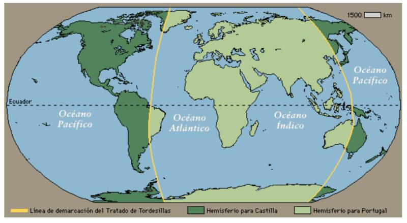
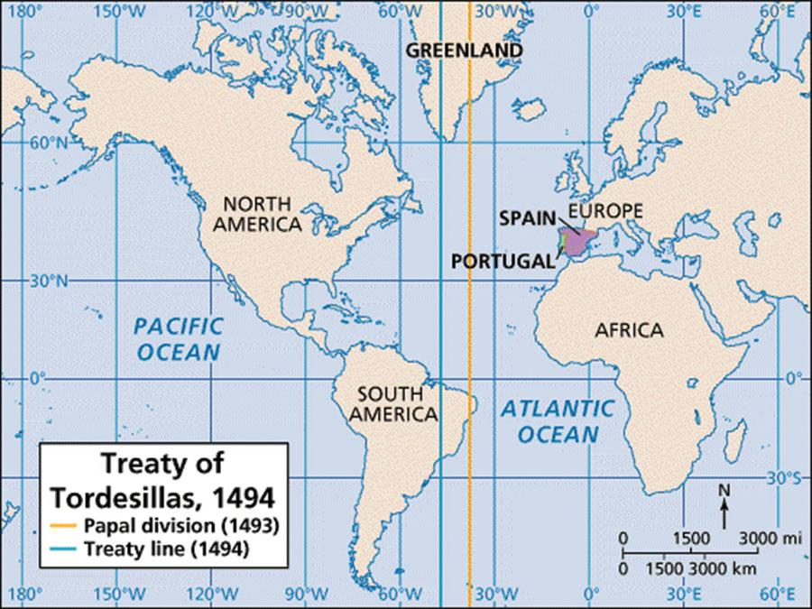

# Jak si Španělé s Portugalci rozdělili svět

*V 15. století se také dělil svět. Tehdy to bylo o dost jednodušší. Věděli jste o Dohodě z Tordesillas? Pokud vám to nic neříká, měl by pro vás být tento text zjevením 😊*

Pohodlně se usaďte, dejte si kávu a čtěte …

V roce 1491 byl svět … malý.

Po Kolumbově první plavbě v roce 1492 vznikl problém: Kolumbus se totiž vrátil do Španělska s tvrzením, že objevil novou cestu do Asie. Portugalci ale protestovali.

Portugalsko mělo už desítky let od papeže potvrzená práva na objevy podél afrického pobřeží a na cestu do Indie kolem Afriky. Najednou přišlo Španělsko s novými objevy a obě země se začaly přít o to, komu budou patřit nově nalezená území.

Proto se Španělé a Portugalci obrátili na papeže Alexandra VI. (Rodrigo Borgia, mimochodem Španěl), aby jejich při rozsoudil.

V roce 1493 vydal papež několik bul, které stanovily pomyslnou čáru v Atlantiku: vše západně od ní mělo připadnout Španělsku.

Portugalcům se to ale vůbec nelíbilo, protože čára byla příliš blízko Evropy a zvýhodňovala Španělsko. A tak nakonec opustili papežské rozdělení světa a setkali se v Tordesillas napřímo. Bylo to v roce 1494. Tam tehdy podepsali smlouvu, která posunula dělicí linii dále na západ.

Čára vedla přibližně 370 námořních mil západně od Kapverdských ostrovů:

- vše na východ od čáry → Portugalsko
- vše na západ → Španělsko

Nikdo v té době ale ani netušil, jak velká Amerika vlastně je.

## Proč se v Brazílii nemluví španělsky

Když Portugalec Pedro Álvares Cabral dorazil roku 1500 k pobřeží Brazílie, ukázalo se, že část Jižní Ameriky leží na portugalské straně dělicí čáry.

Proto Brazílie připadla Portugalsku.

Byla to náhoda? Historici se přou dodnes.

Podle tradičního výkladu ano. Když byla smlouva podepsána, nikdo nevěděl, že tam Brazílie vůbec je. Portugalci prostě měli štěstí, že východní výběžek Jižní Ameriky zasahoval do jejich části světa.

Je tu ale i druhá teorie: někteří historici se domnívají, že Portugalci mohli mít určité indicie, že na západě existuje pevnina. Proto při vyjednávání trvali na posunutí čáry více na západ.

Pro tuto teorii ale neexistuje přímý důkaz. Nemáme žádný portugalský dokument, který by potvrzoval, že Brazílii znali před rokem 1500. Proto většina historiků zůstává opatrná.

Portugalci ovládli oblast dnešní Brazílie a postupně ji rozšířili hluboko do vnitrozemí. Španělé ovládli většinu zbytku Ameriky.

Výsledek vidíme dodnes:

- Brazílie má přes 200 milionů obyvatel a mluví portugalsky.
- Téměř celý zbytek Latinské Ameriky mluví španělsky.

Je fascinující, že jedna čára nakreslená na mapě v kastilském městečku Tordesillas před více než 530 lety dodnes ovlivňuje jazyk, kulturu a identitu stovek milionů lidí. A přitom je docela možné, že vyjednavači vůbec netušili, že právě rozhodují o osudu budoucí Brazílie.

