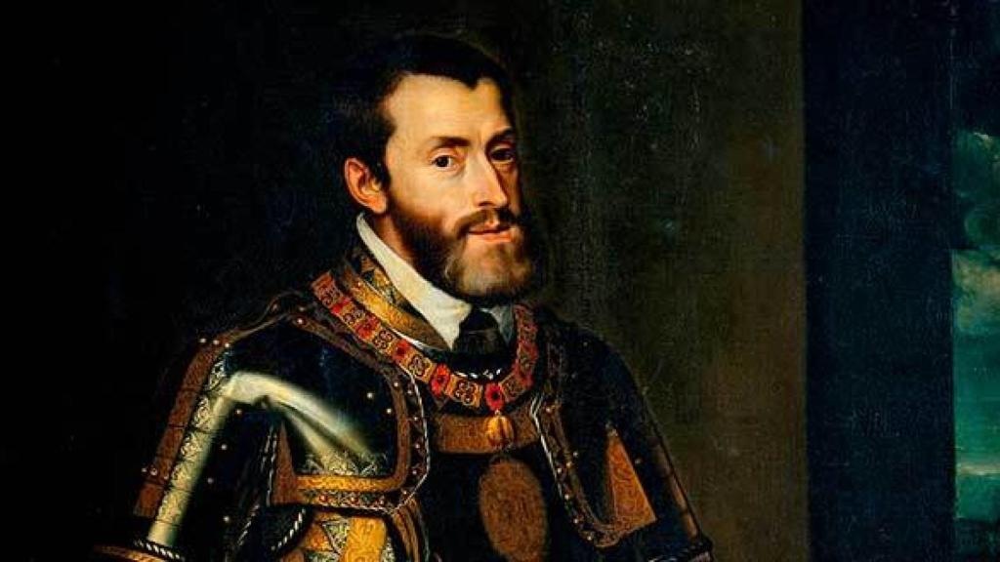

# Když Čechům vládl španělský král

Když se řekne Karel V., většina Čechů si jen obtížně vybaví, o koho šlo. Přitom šlo o jednoho z nejmocnějších panovníků evropských dějin – španělského krále a zároveň císaře Svaté říše římské.

Vnuk slavných Katolických králů Ferdinanda Aragonského a Isabely Kastilské nastoupil v roce 1516 na trůn jako král Kastilie a Aragonie, tedy zemí, které tvořily základ dnešního Španělska. Spolu s nimi zdědil také rozsáhlé državy v Itálii, Nizozemí a zámořská území v Americe.

Teprve o tři roky později, v roce 1519, byl zvolen císařem Svaté říše římské.

A právě tehdy se pod vládou jednoho panovníka ocitla obrovská část Evropy včetně Českého království.

Z dnešního pohledu je zvláštní uvědomit si, že české země tehdy spravoval stejný panovník, který vládl i Španělsku a jeho zámořské říši.

Samozřejmě nešlo o součást Španělska v dnešním smyslu. České království si zachovávalo vlastní zemské instituce, zákony i tradice.

---

## Non plus ultra

Po staletí byly Herkulovy sloupy – dnešní gibraltarská skála a hora Džabal Musa na marockém pobřeží – symbolem hranice známého světa. Právě s nimi bylo spojováno slavné heslo **NON PLUS ULTRA** – „Dále už nic není".

Jenže pak přišly zámořské objevy. Španělsko začalo budovat říši sahající přes oceán až do Ameriky. Staré přesvědčení přestalo platit.

Proto bylo slůvko **NON** odstraněno. Zůstalo jen **PLUS ULTRA** – „Dále za hranice".

Toto heslo si Karel V. zvolil za svůj osobní symbol. Dodnes je součástí španělského státního znaku.

A když dnes ve španělském státním znaku vidíme heslo PLUS ULTRA, díváme se na symbol panovníka, který byl nejen španělským králem a císařem Svaté říše římské, ale také vládcem Českého království.

