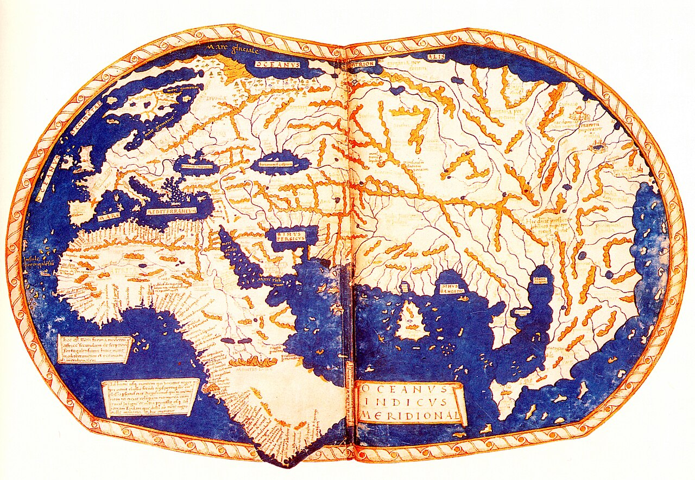
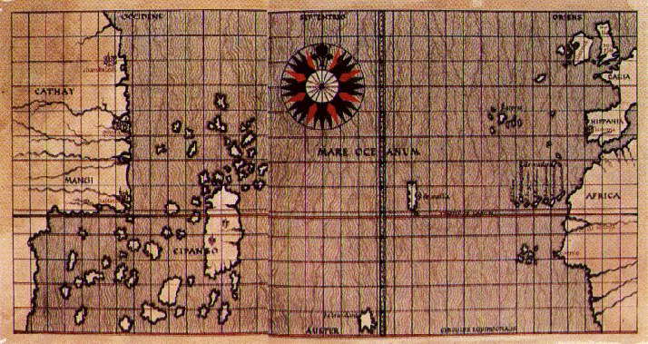

# Objevení Ameriky změnilo celý svět. Ne kvůli Kolumbovi, ale kvůli tomu, co následovalo

Když Kryštof Kolumbus v roce 1492 přistál u břehů Ameriky, domníval se, že našel novou cestu do Asie. Ve skutečnosti ale odstartoval proces, který během několika desetiletí změnil fungování celé planety.

Nešlo jen o objevení nového kontinentu. Začala jedna z největších transformací v dějinách lidstva – takzvaná **kolumbovská výměna**.

Historici tímto pojmem označují obrovský přesun rostlin, zvířat, nemocí, lidí, technologií a myšlenek mezi Starým a Novým světem. Důsledky této výměny byly tak rozsáhlé, že ovlivnily stravování, hospodářství, demografii i mocenské uspořádání světa. Mnozí odborníci proto považují rok 1492 za skutečný počátek globalizace.

Po tisíce let se Amerika vyvíjela odděleně od Evropy, Asie a Afriky. Když se otevřely pravidelné námořní cesty přes Atlantik, začaly mezi oběma světy proudit věci, které dosud existovaly pouze na jedné straně oceánu.

Z Ameriky se do Evropy, Afriky a Asie dostaly brambory, kukuřice, rajčata, kakao, vanilka, paprika, dýně, arašídy nebo tabák. Opačným směrem putovala pšenice, cukrová třtina, káva, citrusy, koně, krávy, prasata a ovce.

Dnes si bez mnoha těchto plodin neumíme představit každodenní život. Italská kuchyně bez rajčat, maďarský guláš bez papriky nebo belgická čokoláda bez kakaa by jednoduše neexistovaly.

Možná největší dopad měla obyčejná brambora. Poskytovala vysoké výnosy i v méně úrodných oblastech a pomohla Evropě uživit rychle rostoucí populaci. Někteří historici se domnívají, že bez brambor by nebyl možný populační růst Evropy v 18. a 19. století, a možná ani průmyslová revoluce v podobě, jakou známe.

Stejně zásadní změnou byl příchod koní do Ameriky. Přestože dávní předkové koní vznikli právě na americkém kontinentu, před tisíci lety zde vyhynuli. Když je Španělé přivezli zpět, změnili tím život mnoha indiánských národů. Kmeny Velkých plání se během několika generací staly vynikajícími jezdci a jejich způsob života prošel zásadní proměnou.

Kolumbovská výměna však měla i svou temnou stránku.

Nejničivějšími „cestovateli" nebyli vojáci ani kolonisté, ale mikroorganismy. Domorodí obyvatelé Ameriky neměli žádnou imunitu vůči evropským nemocem, jako byly neštovice, spalničky, chřipka nebo tyfus. Epidemie se šířily rychleji než samotní dobyvatelé a v některých oblastech během několika desetiletí zahubily až devadesát procent původního obyvatelstva. Šlo o jednu z největších populačních katastrof v dějinách lidstva.

Důsledky však nebyly pouze biologické. Objevení Ameriky zásadně změnilo také geopolitickou mapu světa.

Do konce 15. století bylo těžiště evropského obchodu ve Středomoří. Největší bohatství soustřeďovala italská města, jako byly Benátky nebo Janov, která kontrolovala obchod mezi Evropou a Asií. Významnou roli hrála také Osmanská říše, přes jejíž území vedly důležité obchodní cesty.

Po roce 1492 se však centrum světového dění začalo přesouvat k Atlantiku.

Na významu získaly země s přístupem k oceánu. Nejprve Portugalsko a Španělsko, později Nizozemsko, Francie a především Anglie. Z amerických kolonií proudilo do Evropy obrovské množství stříbra a zlata, vznikaly nové obchodní trasy a Atlantik se postupně stal hlavní tepnou světového obchodu.

Zatímco ve středověku byla Evropa spíše jedním z okrajových regionů Eurasie, v následujících staletích se stala centrem nově vznikajícího globálního systému. Evropské mocnosti vybudovaly rozsáhlé koloniální říše, které zasahovaly do Ameriky, Afriky, Asie i Oceánie.

Poprvé v dějinách vznikl svět, v němž události na jednom kontinentu mohly přímo ovlivnit život lidí na druhém konci planety.

Právě zde leží skutečný význam Kolumbovy plavby. Nebyla důležitá jen tím, že Evropané objevili nový kontinent. Důležitá byla především tím, že propojila dva světy, které byly po tisíciletí oddělené.

Od roku 1492 už neexistovala žádná významná část Země, která by byla zcela izolovaná od zbytku lidstva. Rostliny, zvířata, nemoci, lidé, zboží i myšlenky začaly obíhat kolem celé planety. Zrodil se první skutečně globální svět.

Ať už dnes pijeme kávu, jíme brambory, čokoládu nebo rajčata, používáme produkty světa, který vznikl právě díky této historické změně. Objevení Ameriky tak nebylo jen jednou z významných událostí dějin. Bylo okamžikem, který zásadně přetvořil život na celé planetě a jehož důsledky pociťujeme dodnes.

