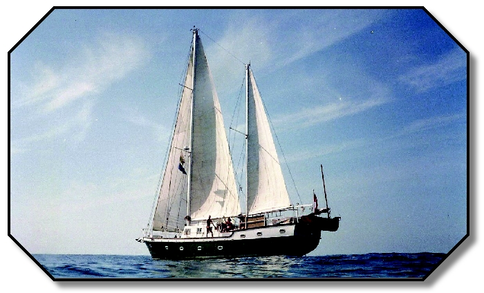

# Jak jsem vařila meruňkové knedlíky na anglickém dvoustěžníku

*Porto Colom, Mallorca*

Psal se rok devatenáctset … a něco… ale to nechme být. Právě se otevřely hranice a já chtěla poznat svět. Jak na to? Zabalit krosnu a na silnici! Vyrazili jsme tedy s přítelem – stopem za dobrodružstvím. Všechno tu bylo pro nás, nic nebylo nemožné. Svoboda, ta lákala nejvíc.

Stopem do Španělska, 2 měsíce toulání po téhle krásné zemi, zpátky do Barcelony. Tam jsme, špinaví, pohublí a šťastní zabloudili do přístavu a viděli lodě. Ty veliké co plují na Baleáry a dál. Spočítali jsme drobné a jupíííí! Máme akorát na cestu na Mallorku! (tedy… jen na cestu tam, ale komu by to vadilo).

Mallorca – miliony turistů, přeplněné město, tohle není to co jsme si představovali. Chceme zpátky. Jenže jaksi nemáme ani na vodu… Co s tím? Stop to vyřeší…

A tady se stal malý zázrak. José, řidič auta co nám zastavilo, měl krásný dům obklopený palmovým hájem, poli broskvoní a mandloní, manželku, která se v tom kamenném paláci nudila a loď v malém přístavu na severu. Jeho pozvání jsme nemohli nevyužít. Strast se proměnila v slast. Najednou jsme byli čistí, najedení, měli vlastní nádherný pokoj a tvořili součást nevšední rodiny (její příběhy by daly na román, ale to jde teď stranou). S Martou jsme jezdili na nákupy a pomáhali jí v domácnosti, starali se o dvouletou Fiore a čekali, až se truhlář José večer vrátí z přístavu. Týden, dva. Půjčili nám nepoužívaný jeep, projeli jsme si ostrov. Jedním slovem SEN. Jen jaksi nebylo za co se vrátit… A tak José vymyslel bojový plán: půjdeme pomáhat Peterovi, Angličanovi, který má v přístavu loď a chystá ji na plavbu kolem světa.

Krásný pokoj jsme vyměnili za kajutu úžasného starobylého korábu „Spinning Jenny of Lune". [Tady je.](https://www.vos.noaa.gov/MWL/apr_11/sailing.shtml)

Drhli jsme podlahy, natírali boky z našeho Dingi (nafukovací člun s docela silným motorem, který jsme „dostali" k vlastní potřebě), spravovali co bylo potřeba. Po práci jsme se proháněli po přístavu i na volném moři, pozorovali hejna ryb jak před člunem skáčou do výšky, na břehu po večerech pili sangriu s dobrodruhy z celého světa, kteří tak jako Peter právě kotvili v Porto Colom, chytali ryby na pytlačku, pluli na sousední ostrovy a ostrůvky, poslouchali neskutečné příběhy, užívali si toho nejlepšího co tenkrát život přinesl. Já jsem na Dingi jezdila nakupovat a vařila jsem námořníkům (tedy Peterovi a těm, kteří zrovna přišli). Mimo jiné meruňkové knedlíky – měly takový úspěch, že se u nás na lodi vystřídala půlka přístavu a já jsem musela ten velký český úspěch několikrát opakovat. Nový Zéland, JAR, Kanada, Filipíny… prostě svět na kolenou před tou dobrotou.

Tahle pohádka, která se stala, ve mně zanechala lásku k moři, námořníkům a hlavně k nekonečné svobodě.

Od té doby uplynulo mnoho let.

Žila jsem ve Španělsku na různých místech, poznala jsem velká města i zapadlé vesnice, bydlela jsem v centru Barcelony, na ostrovech, v horách Andalusie i u moře. Ale právě Porto Colom a starý anglický dvoustěžník mi navždy připomínají, proč jsem se do Španělska kdysi zamilovala.

Protože Španělsko nejsou jen pláže, hotely a turistické atrakce. Jsou to malé přístavy, kde se lidé ještě znají jménem. Jsou to rybářská městečka, kde si za cenu garsonky v Praze můžete koupit celý dům. Jsou to náhodná setkání, která změní život. A někdy také stará loď, na které vaříte meruňkové knedlíky pro námořníky z celého světa.

Právě takové Španělsko mě zajímá dodnes.

