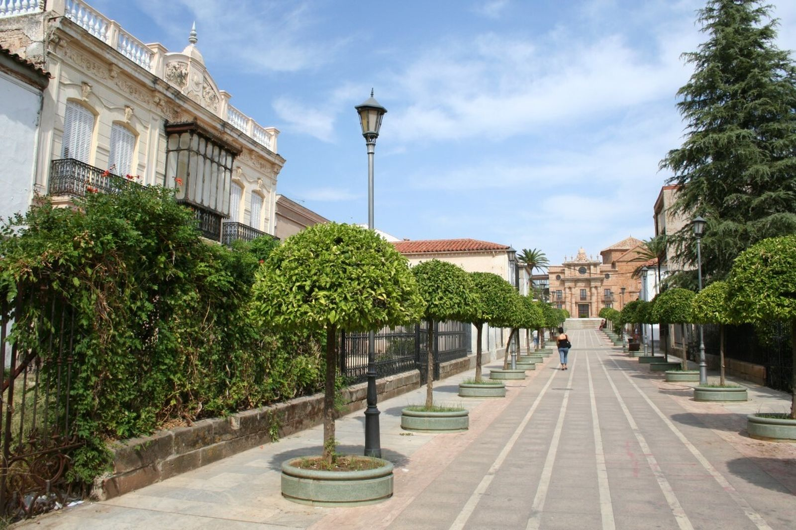

# La Carolina – trochu jiný jih

Připravuju si takhle další text. Baví mě to. Sbírám si data o jednom andaluském městečku, které skoro nikdo nezná, a které na mě včera vyskočilo při srovnávání cen nemovitostí ve Španělsku. (je to tam levný, hodně levný – v tom městečku myslím 😊).

Začala jsem z toho připravovat něco, co by dávalo hlavu a patu … a zasnila jsem se … psala jsem a tak to sem přináším 😊. Dokážete si to představit? Dneska chci psát o jednom místě, které ani spousta Španělů nezná. Je fantastické. Španělské, jižní, levné a mě by se tam líbilo žít.

Dokážu si to představit a myslím, že by se mi tam žilo celkem fajn.

Že bych si mohla dovolit mít lepší bydlení než mám tady za míň peněz, že bych ty peníze měla pro sebe a svoji rodinu.

Že bych měla parádní zdravotní péči a jako živnostník bych platila 80,- Eur za měsíc za všechno. Klidně první dva roky.

Začala bych nějakej svůj projekt. Malou kavárničku s knihkupectvím nebo květinářství s bylinkama nebo co já vím. Už jsem uvažovala i o práci v technických službách: pracují tam většinou mladí lidé, ale je tam mix, pracuje se venku, pečuje se o městskou zeleň – to by se mi asi líbilo. Měla bych čistou hlavu.

Že bych tam chodila do knihovny, jezdila na kole nebo na vespě, účastnila bych se slavností, byla bych aktivní v nějakém spolku, scházela bych se s přáteli a bylo by mi dobře.

Občas bych zajela autobusem nebo vlakem do Jaenu za kulturou a za dobrým vínem, občas bych autobusem nebo vlakem zajela do Madridu nebo míst v Kastilii a určitě bych si to nějak zaonačila, abych si mohla zajet občas k moři (až bych byla v důchodu, bylo by to extra jednoduchý díky IMSERSO, což je program pro španělské důchodce). Po Španělsku, nebo jinde, to záleží na tom, jak moc a jak bych chtěla pracovat. Bylo by tam spousta slunečných dní, tepla, na podzim bych neupadala do depresí, v zimě bych mohla chodit po okolních lesích – ráda chodím a tam by to krásně šlo. Je tam dobré víno, nejsem z těch co to dostatečně ocení, ale asi bych si občas sklenku dala, protože to chutná dobře. A dobře se to pije s přáteli. Jedla bych zdravě – měla bych neskutečnej výběr naprosto čerstvý zeleniny a ovoce včera sebraný o kousek dál. Každý den čerstvý džus ze sladkých mačkaných pomerančů. Ten nejlepší olivovej olej na světě. Vybírala bych si – jako to dělají místní – hmmm, tahle značka … jak na tom byli minulej rok? Jaká byla sklizeň? … v tom bych se vyžívala. Mnohem víc bych se pohybovala. Už prostě proto, že by mi venku nebyla zima. Bylo by tam čisto, bezpečno, lidé by se znali a oslovovali by mě jménem. Já bych k nim byla slušná a uctivá a oni by byli slušní a uctiví ke mně. Většina z nich…

No jo … no…

……

Andalusie jsou pro nás většinou bílé vesničky nebo přímořská letoviska, olivové háje, moře, býčí zápasy a flamenco.

Tohle místo je ale jiné.

Jmenuje se La Carolina a leží na severu provincie Jaén, na úpatí pohoří Sierra Morena, nedaleko přírodního parku Despeñaperros. Právě tudy po staletí vedla hlavní cesta mezi Madridem a Andalusií. Dnes okolo města prochází dálnice A-4 a z La Caroliny je to přibližně 50 minut do Jaénu, hodinu a půl do Granady, dvě a půl hodiny do Málagy a necelé tři hodiny do Madridu.

Na první pohled působí jako běžné andaluské městečko. Jenže není.

## Jak město vypadá a čím je výjimečné?

La Carolina není typickou andaluskou vesnicí s křivolakými uličkami. Je to „urbanistický klenot Andalusie". Město bylo založeno v roce 1767 králem Karlem III. jako modelové město osvícenství. Má fascinující pravidelný šachovnicový půdorys s širokými, rovnými bulváry a velkými náměstími, což v této části Španělska působí téměř „americkým" dojmem. Díky tomu je zde pohyb městem i parkování velmi snadné.

## Obyvatelé a historie, která nás spojuje

Město má přibližně 14 700 obyvatel (tzv. carolinenses). Zajímavostí pro nás je, že prvními osadníky bylo přes 6 000 kolonistů ze střední Evropy, především Němců a Švýcarů, kteří sem přinesli své zvyky i příjmení, jež v oblasti dodnes najdete.

Dnes zde žije přibližně 15 tisíc obyvatel a některá příjmení stále připomínají německé či švýcarské kořeny prvních osadníků. Toho, co nás spojuje, je v té historii víc – psala jsem o tom [v textu o Karlu V.](../historie/kdyz-cechum-vladl-spanelsky-kral.html) Je to všechno hodně zajímavé.

## Jak se tu žije a co se tady dá dělat?

Dobře.

Jsou školy, střední školy, sportoviště, městský bazén, zdravotní středisko, supermarkety, restaurace i běžné služby. Větší nemocnice jsou v Linaresu (20 minut autem) a v Jaénu. Univerzitní kampus je také v Linaresu a hlavní univerzita v Jaénu.

Není to turistická oblast. Nepotkáte zde davy cizinců ani celé domy apartmánů pro turisty. Většinu obyvatel tvoří místní Andalusané.

Město leží v srdci pohoří Sierra Morena, což znamená, že přírodu a turistické trasy máte hned za dveřmi.

**Občanská vybavenost:** Najdete zde vše potřebné – od supermarketů (např. Día) a obchodů v hlavní ulici Calle Madrid přes školy, jazykové akademie až po moderní sportoviště a městský bazén.

**Čistota a pořádek:** Návštěvníci si často pochvalují čistotu města a funkční, křišťálově čisté fontány na náměstích.

## Kultura a zábava: čím tu žijí a co se tu dá dělat?

Život se tu odehrává hlavně pro místní — na náměstích, v barech, v městském divadle, na trzích, při slavnostech, procesích, feriích a víkendových setkáních.

Během běžného týdne je to klidné andaluské město. Lidé chodí do práce, děti do školy, senioři posedávají v kavárnách, odpoledne se život přesouvá do barů a na procházky. O víkendu se centrum probouzí hlavně kolem náměstí, kaváren, restaurací a místních podniků. Není to ruch Málagy ani Sevilly, spíš normální španělský rytmus: dopolední káva, nákup, aperitiv, oběd, večerní paseo a posezení s přáteli.

A pak jsou období, kdy La Carolina opravdu ožije.

V únoru se slaví Candelarias y Rosquillas de San Blas. V jednotlivých čtvrtích se zapalují ohně, sousedé se scházejí venku, peče se, povídá se a slavnost někdy končí až ráno churros s čokoládou. Je to přesně ten typ lokální tradice, kterou v turistickém letovisku nezažijete.

Krátce poté přichází karneval, který má v La Carolině velmi dobrou pověst v celém okolí. Ulice ovládnou masky, průvody, comparsas a chirigotas — tedy satirické pěvecké skupiny typické pro španělský karneval. Karneval trvá několik dní a končí tradičním „pohřbem sardinky". A co je zajímavé: v La Carolině se karneval podle místních zdrojů slavil i v dobách, kdy byl jinde zakázaný.

Na jaře přichází Semana Santa, tedy Svatý týden. Procesí, bratrstva, hudba, vůně kadidla, svíce, ticho v ulicích — klasická andaluská zbožnost, ale v menším a komornějším měřítku než ve velkých městech. Zde člověk nestojí v davu turistů, ale sleduje slavnost, kterou město opravdu žije.

A právě o Velikonocích se objevuje jedna z nejkrásnějších zvláštností La Caroliny: Pintahuevos. Jde o tradici malování velikonočních vajec, kterou sem přinesli středoevropští kolonisté v 18. století. V Andalusii by člověk čekal procesí, býky, flamenco nebo olivový olej — ale malovaná vajíčka? Právě tady ano. A je to jeden z nejhezčích důkazů, že La Carolina má opravdu jinou historii než většina andaluských měst.

V květnu se koná Feria de Mayo. To už je klasická andaluská zábava: hudba, atrakce, stánky, rodiny s dětmi, senioři, koně, hospodářská zvířata, jezdecký průvod, caseta municipal, koncerty a společné jídlo. Feria tu není jen „lunapark", ale i připomínka venkovského a zemědělského charakteru oblasti.

V červenci město slaví Fiestas de la Fundación, tedy výročí svého založení. A tady se historie neukládá jen do muzea — vychází do ulic. Konají se historické rekonstrukce, komentované a teatralizované prohlídky, kulturní akce, rodinné hry, trhy připomínající kolonisty a předávání cen. Připomíná se rok 1767, kdy král Karel III. založil La Carolinu jako hlavní město takzvaných Nových osad Sierra Moreny.

V červenci se v okolí připomíná také bitva u Las Navas de Tolosa, jedna z klíčových bitev španělských dějin. A zase — nejde jen o suchý údaj v učebnici. V kraji se tato historie objevuje v památnících, slavnostech, názvech míst i místní identitě.

Na podzim se La Carolina připomíná i gastronomicky. Místní specialitou je paté de perdiz, tedy paštika z koroptve. V posledních letech se kolem ní pořádají gastronomické akce, soutěže, showcookingy a degustace. K tomu se přidávají trasy tapas, kdy lidé chodí po zapojených barech a restauracích, ochutnávají malé porce a hlasují pro nejlepší tapa.

A kulturní život? I ten tu existuje. Město má Teatro Carlos III, kde se konají divadelní představení, koncerty, dětské muzikály, karnevalové soutěže nebo kulturní programy. V létě se tu pořádá také Festival Puerta de Andalucía, který už přiváží i známá jména španělské hudební scény.

Takže ne — La Carolina není ospalá díra, kde se po šesté večer zhasne.

Je to malé město, kde se žije normálně, lokálně a po španělsku. Bez davů turistů, bez přepálených cen, bez pobřežní hysterie. Ale s kavárnami, slavnostmi, divadlem, gastronomií, historií, procesími, feriemi a velmi silným pocitem místní identity.

Je to místo pro člověka, který nepotřebuje každý večer nový beach bar, ale ocení skutečný život španělského města.

## Dá se tu najít práce?

La Carolina není jen levné městečko uprostřed olivových hájů. Je to jedno z průmyslových center severní Andalusie.

Město má sice jen kolem 15 tisíc obyvatel, ale disponuje třemi průmyslovými zónami o rozloze přes 700 000 m² a sídlí zde téměř 100 firem. Místní radnice se dokonce aktivně prezentuje jako průmyslové centrum severní Andalusie.

### Největší zaměstnavatelé přímo v La Carolině

**ALVIC Group** — jeden z největších zaměstnavatelů v regionu. Firma vyrábí nábytkové komponenty, kuchyně, designové povrchy a interiérové materiály. Zaměstnává stovky lidí.

**Clarton Horn** — výrobce automobilových houkaček a elektronických komponentů pro automobilový průmysl. Patří mezi významné průmyslové podniky v oblasti.

**Surtel Electrónica** — elektronická firma založená bývalými zaměstnanci Siemensu po uzavření místního závodu.

**Menší průmyslové firmy** — v okolí fungují desítky menších podniků zabývajících se kovovýrobou, nerezovými konstrukcemi, průmyslovými službami a opravami strojů, jsou tu lakovny a samozřejmě stavebnictví a potravinářství – jako všude ve Španělsku.

### Linares – skutečný zdroj pracovních příležitostí

A tady začíná být situace opravdu zajímavá: Linares je vzdálený asi 20 minut autem a má téměř 60 tisíc obyvatel. Po letech úpadku se zde znovu rozjíždí průmysl.

**Santana Motors** — legendární automobilka Santana obnovila výrobu. Plánuje vytvořit přibližně 170–200 pracovních míst v následujících letech. Zajímavé příležitosti tu můžou být při montáži vozidel, v logistice, ve skladu, nákupu, administrativě nebo na technických pozicích.

**Escribano Mechanical & Engineering** — moderní španělská technologická firma zaměřená na obranný průmysl. V Linaresu vzniká nový závod s očekávanými asi 150 pracovními místy (strojírenství, konstrukce, CAD, projektové řízení, elektrotechnika, výroba).

**Desay SV** — čínská technologická společnost vyrábějící elektroniku a displeje pro automobily. Počítá se s vytvořením stovek pracovních míst.

## A teď to nejzajímavější – ceny nemovitostí

Průměrná cena nemovitostí se zde pohybuje kolem 640 € za metr čtvereční. Ano, čtete správně. Za částku, za kterou si na pobřeží často nekoupíte ani garáž, zde můžete pořídit byt nebo dům.

Dnes jsem například našla:

- byt 50 m² s balkonem a výtahem za 450 € měsíčně
- tradiční andaluský statek (cortijo) se 100 m² obytné plochy, bazénem, dvěma studnami a pozemkem o rozloze 1,5 hektaru s 200 olivovníky za 530 € měsíčně

…

No, já bych tam žila 😊

