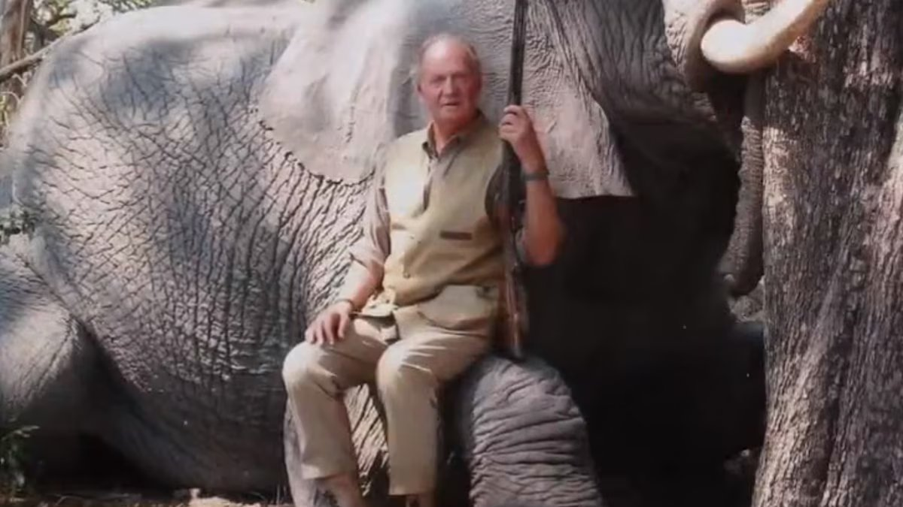
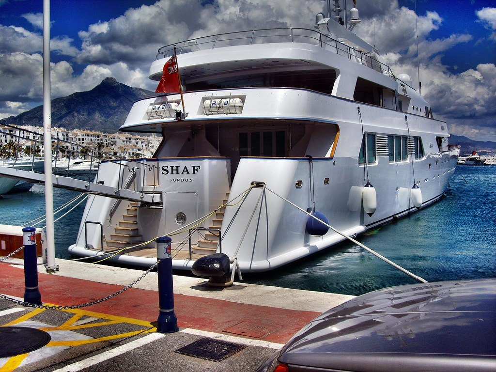

# Když monarchie přestane krýt rodinu za každou cenu

Španělská monarchie v posledních patnácti letech zažila něco, co se dá číst jako učebnicový příklad toho, jak se královský dvůr může stát rukojmím vlastních rodinných kompromisů – a jak rychle se reputační kapitál rozplyne, když se veřejnost začne ptát na to nejjednodušší: kdo za co platí, kdo s kým obchoduje, kdo je čí host a proč.

Španělsko je konstituční monarchie. Král není výkonný politik, je symbolem kontinuity státu. A právě proto je jeho největší měnou důvěra. Když ji ztratí, není to jen osobní drama jedné rodiny – je to otřes instituce.

## Juan Carlos: král určený Frankem, který nešel jeho cestou

Juan Carlos I. byl generálem Francem vybrán a v roce 1969 oficiálně určen jako jeho nástupce. Předpokládalo se, že bude pokračovat v autoritářském kurzu režimu. Po Frankově smrti v roce 1975 se však vydal jinou cestou a podpořil přechod k pluralitní demokracii a ústavnímu systému.

Klíčovým momentem byl 23. únor 1981, kdy skupina příslušníků civilní gardy v čele s podplukovníkem Tejerem vtrhla do parlamentu a zadržela poslance jako rukojmí. Televizní vystoupení krále v uniformě vrchního velitele ozbrojených sil, v němž puč odmítl, sehrálo zásadní roli při jeho zmaření. Zrodil se silný mýtus: KRÁL, KTERÝ ZACHRÁNIL DEMOKRACII.

Tenhle mýtus byl ve Španělsku tak silný, že mnohé z králova zákulisního života zůstávalo dlouho stranou veřejného zájmu.

Jenže monarchie stojí na symbolech. A symbol může padnout v jediný okamžik. Pro Juana Carlose tím okamžikem byl duben 2012 a Botswana.

## Botswana 2012: slon, zlomená kyčel a otázky, které už nešlo přehlížet

Juan Carlos odjel soukromě do Botswany na safari spojené s lovem slonů. Cesta měla zůstat před veřejností skrytá. Jenže král si při pobytu zlomil kyčel a musel být urychleně převezen do Madridu. Teprve tehdy se Španělsko dozvědělo, kde hlava státu byla – a v jakém stylu.

Krátce po operaci král pronesl větu, která vstoupila do dějin: „Lo siento mucho. Me he equivocado y no volverá a ocurrir." („Velmi mě to mrzí. Udělal jsem chybu a už se to nebude opakovat.")

Jenže omluva nestačila. Poprvé se začalo otevřeně mluvit o tom, že problém není jen v lovu slonů.

Španělsko tehdy procházelo hlubokou hospodářskou krizí, nezaměstnanost přesahovala 20 %, mladí lidé neměli práci. Luxusní safari v Africe působilo jako výsměch.

Botswana ale nebyla jen o lovu.

Právě tato cesta výrazně zviditelnila i jeho mimomanželský vztah s Corinnou Larsen, která byla na safari přítomna. A především otevřela širší otázku: odkud pocházejí peníze, v jakých kruzích se král pohybuje a jaké vazby má na zahraniční elity – zejména na monarchie Perského zálivu?

## Saúdské vazby: stará přátelství a nová podezření

Juan Carlos měl s vládci Perského zálivu dlouhodobé vztahy už od 70. let. V době ropné krize hrál roli prostředníka při navazování kontaktů se Saúdskou Arábií. Postupně se mezi ním a některými členy saúdské královské rodiny vytvořily osobní vazby.

Je doloženo, že saúdští panovníci trávili léta ve Španělsku, zejména v oblasti Marbelly a Puerto Banús, kde měli své rezidence a kde kotvily jejich jachty (Shaf London najdete v Puerto Banús i dnes). Juan Carlos je během těchto pobytů navštěvoval. Samotná přítomnost na jachtách ani společenské kontakty samozřejmě nejsou trestným činem – ale v kontextu pozdějších finančních kauz začaly být tyto vztahy nahlíženy jinak.

A právě tady se objevuje jméno Mohameda Eyada Kayaliho.

## Mohamed Eyad Kayali: most mezi Botswanou a Perským zálivem

Kayali je v seriózním španělském tisku zmiňován především jako muž, který krále do Botswany pozval. Investigativní texty (např. Orient XXI) ho zároveň popisují jako podnikatele napojeného na saúdský okruh a člověka, který zajišťoval logistiku a majetkové záležitosti saúdských elit ve Španělsku.

Jihoafrická investigace amaBhungane, opírající se mimo jiné o Panama Papers a Paradise Papers, ho pak spojuje s offshore strukturami, v nichž figuroval jako ředitel nebo držitel plných mocí ve společnostech napojených na saúdská aktiva – nemovitosti, firmy či luxusní majetek.

Nic z toho samo o sobě není rozsudkem. Ale dohromady to vytváří obraz prostředí, kde se mísí politika, byznys, luxus a neprůhledné struktury.

A právě do tohoto prostředí Botswana zapadla až překvapivě přesně.

## Corinna Larsen: dar 100 milionů dolarů a švýcarská stopa

Corinna Larsen nebyla jen králova milenka. Postupně se stala klíčovou postavou v debatě o podivných finančních tocích.

V roce 2008 převedl saúdský král Abdalláh 100 milionů dolarů na účet nadace Lucum, registrované v Panamě, jejímž zakladatelem byl Juan Carlos. Účet byl veden ve švýcarské bance Mirabaud. Podle vyjádření Juana Carlose šlo o osobní dar.

V roce 2012 byla část těchto prostředků (zhruba 65 milionů dolarů) převedena na účet Corinny Larsen. Král později tvrdil, že šlo o osobní dar. Švýcarské vyšetřování zkoumalo, zda peníze souvisely s provizemi za zakázku na vysokorychlostní železnici mezi Mekkou a Medinou. Řízení bylo nakonec uzavřeno bez obžaloby pro nedostatek důkazů.

Formálně tedy nebyl Juan Carlos v této věci odsouzen. Ale reputační škoda byla obrovská.

## Zeť, který šel sedět: kauza Nóos

A pak přišla další rána – tentokrát z bezprostředního rodinného kruhu.

Iñaki Urdangarin, manžel infantky Cristiny, byl v 90. letech sportovní hvězdou. Reprezentoval Španělsko v házené, získal olympijské medaile, působil jako moderní, sympatická tvář monarchie. Pamatuji si jeho svatbu s infantkou Cristinou v barcelonské katedrále sv. Eulálie – tehdy byl miláčkem publika.

Kauza Nóos ale ukázala jiný obraz. Urdangarin prostřednictvím neziskového institutu Nóos získával veřejné zakázky od regionálních vlád, přičemž část prostředků byla podle soudu vyváděna do soukromých struktur.

V roce 2018 byl pravomocně odsouzen k pěti letům a deseti měsícům vězení za zpronevěru, podvody a zneužití vlivu. Nastoupil do výkonu trestu ve věznici Brieva v provincii Ávila. Část trestu si skutečně odpykal, později mu byl režim zmírněn.

Manželství s infantkou Cristinou tlak celé kauzy nepřežilo – po letech postupného rozchodu byl jejich rozvod dokončen v roce 2024.

To byl moment, kdy se z osobních skandálů stala systémová krize.

## Felipe VI.: oddělení instituce od rodiny

Syn Juana Carlose, Felipe VI., po nástupu na trůn pochopil, že monarchie může přežít jen tehdy, pokud se od problémů distancuje.

V roce 2020 veřejně oznámil, že se vzdává jakéhokoli budoucího dědictví po otci a že Juan Carlos přichází o státní apanáž. Král tím vyslal jasný signál: instituce není štítem pro rodinné kauzy.

Krátce poté Juan Carlos odešel do exilu do Spojených arabských emirátů.

Byl to dramatický krok. Ale byl to také pokus o záchranu instituce.

## Proč to připomínat

Existují věci, které jsou soudně prokázané. A existují věci, které zůstávají v šedé zóně – investigace, úniky dokumentů, podezření, která nikdy nepřerostou v rozsudek.

Jenže monarchie není jen právní konstrukce. Je to symbolická instituce.

A symbol nemůže dlouhodobě přežít, pokud veřejnost získá pocit, že existují dvě roviny reality: jedna pro běžné občany a druhá pro rodinu u dvora.

Proto mi Kosatíkův text připomněl právě Španělsko. Moderní monarchie se udrží jen tehdy, když dokáže říct „ne" i vlastním lidem. Když přijme, že rodina není nad právem.

A že důvěra se ztrácí rychleji než trůn.

## Fotografie

**1 a 2** – španělský král Juan Carlos v Botswaně předtím, než si poranil kyčel:

**3** – jachta saúdské královské rodiny Shaf London kotvící v přístavu Puerto Banús (Marbella, Španělsko):

**4** – tzv. Milla de oro (Zlatá míle) v Marbelle, kde jsou paláce, rezidence a vily evropské „jet-set" i saúdského krále Fahda:

