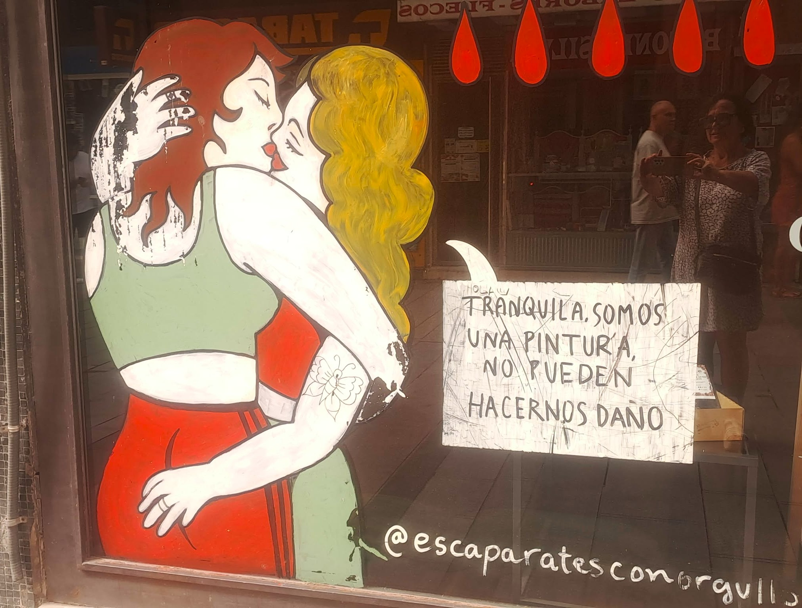
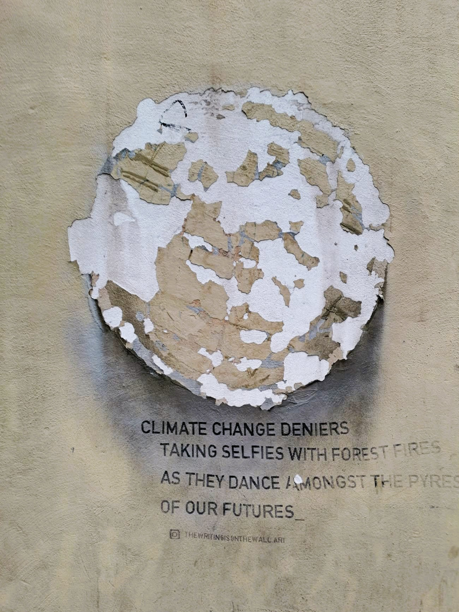
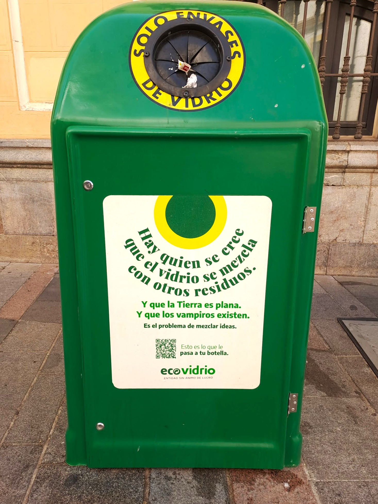

# O svobodě

Čím déle se pohybuji ve Španělsku a Katalánsku, tím víc si uvědomuji, že SVOBODA tady není slogan ani ideologický boj.

Je to každodenní praxe. Začíná u ELEMENTÁRNÍ LIDSKÉ SLUŠNOSTI.

U otázky: „Vadí vám to?" U schopnosti sdílet prostor s někým, kdo je jiný – věkem, názorem, stylem života.

V Barceloně (i jinde v Katalánii a ve Španělsku) je vidět v ulicích: Na zdech domů se tu mluví o klimatu, ekologii, svobodě myšlení, sexualitě, identitě. Někdy vážně, jindy s ironií, často s humorem. Ale téměř nikdy zle.

## K fotkám

**1.** Tahle výloha není z Barcelony, nýbrž z Córdoby, stále konzervativní Andalusie. Dvě ženy se líbají a vedle nich je věta:

> „Klid, jsme jen obrázek, nemůžeme ti ublížit."

Žádný manifest. Žádná provokace. Jen tiché konstatování.

**2.** Na jedné z barcelonských zdí je jednoduchý anglický text:

> „Popírači klimatické změny si dělají selfie u lesních požárů, zatímco tančí v plamenech naší budoucnosti."

Není to výhrůžka. Je to ostré, ale klidné pojmenování reality. Bez křiku. Bez nálepek.

**3.** O pár ulic dál visí plakát s jiným sdělením:

> „Jen pro případ, že ti to dnes nikdo neřekl: ahoj, dobré ráno, jsi skvělá, věřím ti… a ten zadek!"

Humor, nadsázka, lidskost. I to je svoboda projevu.

**4.** A pak jsou tu věci úplně praktické. Třeba kontejner na sklo v Córdobě. Je na něm napsáno:

> „Jsou lidé, kteří si myslí, že sklo můžou smíchat s ostatním odpadem. A taky jsou tací, kteří věří, že Země je placatá. A že upíři existují. To je ovšem problém míchání myšlenek."

Jasné sdělení. Bez urážek. S úsměvem.

Španělé a Katalánci jsou přitom výrazně „nekorektní". Politicky i lidsky. Platí tu nepsané pravidlo, že každý má právo říct svůj názor – i nepohodlný, i nekorektní. Když s ním někdo nesouhlasí, klidně se pohádají. Nahlas. Emotivně. Někdy to vypadá, jako by se neměli rádi. Ale tím to končí.

Ten člověk ten názor řekne znovu příště. A ostatní ho vezmou úplně stejně. Není to konec přátelství, vztahu ani rodiny. Dokonce i v rodinách – což mě zpočátku opravdu zaskočilo – se mluví otevřeně prakticky o všem. Bez obav, že „tohle se neříká". Bez strachu, že tím někoho navždy ztratíte.

A právě tady si čím dál víc uvědomuji rozdíl, který doma v Česku cítím stále silněji: autocenzuru.

Snaha se někoho nedotknout. Raději mlčet. Raději neříct. Raději „to nechat být". Jenže tohle není tolerance. To je ticho ze strachu.

Svoboda projevu tu neznamená bezohlednost. Neznamená křik. Neznamená umlčování. Znamená schopnost unést, že někdo jiný vidí svět jinak. A mluvit spolu i tehdy, když spolu nesouhlasíme.

Možná svoboda nezačíná u velkých slov. Možná začíná u odvahy mluvit – a u jistoty, že kvůli tomu nepřijdeme o místo u stolu. Na lavičce. Nebo v autobuse.
