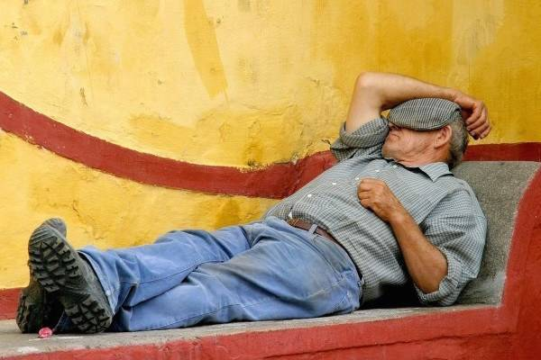

# Španělský rytmus života (1. díl)

Musím se smát při vzpomínce na padesátičlennou skupinu Španělů z jihu (převážně z Cádizu a okolí). Přišli o práci v cádizských loděnicích: ze dne na den zůstalo bez práce asi 1500 chlapů a mnozí z nich se, jako spousta dalších Španělů, nechali najmout agenturami, které je posílaly pracovat do zahraničí.

Těchto 50 „tropických kousků" přistálo v malém českém městě s velkou fabrikou.

V zimě. Ti chlapi nikdy neviděli sníh!

Vstávat v pět za tmy, ledovým ránem a plískanicí k píchačkám.

Měla jsem s nimi projít školení bezpečnosti práce, testy a první týdny fungovat jako tlumočnice a spojka s firmou.

První den jdu tedy s nimi. Hrají si na hrdiny. Dokonce z poloroztálého sněhu udělají holýma rukama několik koulí a házejí je po sobě jako malí kluci.

Šichta začíná. Bez kafe. Bez cigára. Hoši jsou zmatení … rovnou pracovat???

V 7:30 je obcházím, jestli něco nepotřebují. Unavený pohled a odpovědi jako přes kopírák: „Kafe." „Cigáro." „Spát."

V 8:30 chodím od jednoho k druhému znovu. Tentokrát se už ani neptám. Zoufalé pohledy mluví za vše.

Konečně. Půl desáté. Deset minut pauza. Ženou se k automatu pro kafe a okamžitě ven. Padá déšť se sněhem a je nevlídno. Za chvíli hlásím, že zbývají tři minuty do konce pauzy. Ve stu tmavých očí vidím úžas a nepochopení. Ale vylijou kafe, típnou skoro celý cígo a co noha nohu mine se šourají na svá pracoviště.

V 11:30 zní siréna. Co co? Co se děje? Chlapi, oběd! … cožeeeee???? V jedenáct třicet?" :-D

Španělsko je velká země a ne všude funguje všechno stejně. Přesto se dá říct, že rytmus dne je v mnoha částech Španělska dodnes jiný než u nás.

Ačkoliv je Španělsko ve stejném časovém pásmu jako Česká republika, leží výrazně více na západě. Slunce tam proto vychází i zapadá později (ten rozdíl může být až hodina).

Ráno ve Španělsku začíná sprchou. Lidé odcházejí z domu upravení, navonění a mnohdy ještě s mokrými vlasy.

Ve většině škol začíná vyučování mezi osmou a devátou hodinou, často kolem deváté. Děti bývají sváženy školními autobusy a během dopoledne mají delší přestávku, tzv. patio.

Většina škol má hřiště nebo alespoň prostor, kde děti tráví čas venku. Hrají fotbal, skáčou přes švihadlo, povídají si, běhají. Španělské děti tráví venku obecně mnohem více času než ty naše.

Hlavní jídlo dne bývá oběd.

V mnoha rodinách se obědvá mezi 14. a 15. hodinou, někdy i později. V Cádizu spíš kolem té třetí :-D

A pak přichází siesta.

Ne všude a ne vždy. Ve velkých městech nebo moderních kancelářích už často neexistuje.

V menších městech a především na jihu Španělska je ale stále běžná.

Původně šlo o čas, kdy se rodina scházela doma na oběd. Povídalo se, jedlo se pomalu a po jídle následoval krátký odpočinek.

Siesta není o lenosti.

Především v Andalusii a některých vnitrozemských oblastech bývají letní teploty tak vysoké, že polední přestávka dává dokonalý smysl.

Když největší vedro pomine, život se znovu rozběhne. Obchody otevírají. Lidé se vracejí do práce. Ulice znovu ožívají.

V kancelářích se končí v pět, šest, ale klidně i v sedm večer. Mnoho obchodů zavírá až kolem deváté hodiny.

A pak přichází večer. Ten pravý španělský. O tom ale příště.
