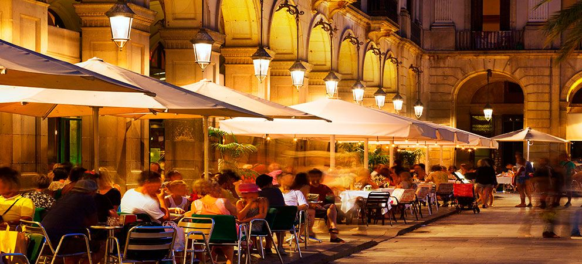

# Španělský rytmus života (2. díl): vermut, dlouhé obědy a proč Španělé nikam nespěchají

Španělé mají jedno pořekadlo, které mi přijde geniální: *no vivo para trabajar. Trabajo para vivir.* Tedy … nežiju, abych pracoval. Pracuju, abych žil.

Pokud vám v prvním díle přišlo, že Španělé jedí pozdě, počkejte, až zažijete španělskou sobotu.

První týdny ve Španělsku bývají pro Středoevropana trochu matoucí. V jedenáct dopoledne se vám zdá, že je nejvyšší čas něco dělat.

Španěl si v tu dobu teprve sedá na sluníčko před bar a objednává si vermut.

Ne, není to oběd. A vlastně ani svačina. Je to … prostě vermut.

Existuje dokonce výraz „hacer el vermut", tedy doslova „jít na vermut".

Nejde ale ani tak o samotný nápoj jako o společenský rituál: sejde se rodina, přijdou přátelé. Objedná se něco malého na zobání – olivy, mandle, chipsy, berberechos, ančovičky nebo tapas.

Někdo si dá vermut. Někdo pivo. Někdo nealko.

Sedí se. Povídá se. Nikdo nikam nepospíchá.

Po vermutu často následuje procházka.

A pak oběd.

Pokud jste zvyklí obědvat ve dvanáct, budete si ve Španělsku připadat trochu jako mimozemšťané. V mnoha rodinách se totiž o víkendu nezačíná obědvat dříve než ve dvě hodiny odpoledne, a velmi často až kolem třetí.

A není to rychlé jídlo mezi dvěma povinnostmi.

Oběd je událost.

Běžný rodinný oběd mívá několik chodů:

Nejprve „PRIMER PLATO". Může to být salát, zelenina, polévka, těstoviny, rýže nebo jiné lehčí jídlo.

Následuje „SEGUNDO PLATO". Ryba. Maso. Paella. Dušená jídla. Podle regionu a ročního období.

K obědu se běžně podává voda a víno.

Po hlavním jídle přichází „POSTRE" – dezert. Někdy ovoce. Jindy flan, natillas nebo nějaká domácí sladkost.

A samozřejmě káva. Malá, černá, sladká.

Bez kávy jako by oběd ani neskončil.

Jak už asi tušíte, tohle se nedá sníst za půl hodiny. Rodinný oběd může trvat dvě, tři, někdy i čtyři hodiny. A nikomu to nepřijde zvláštní.

Naopak.

Právě společně strávený čas je tím nejdůležitějším.

Večer život pokračuje.

Především v teplých měsících se lidé vracejí do ulic. Děti si hrají na náměstích. Rodiny se procházejí. Bary a restaurace se pomalu plní.

Když jsem byla ve Španělsku poprvé, fascinovalo mě, kolik malých dětí člověk potká venku ještě pozdě večer: kočárky, babičky, rodiny, skupinky teenagerů.

Všichni venku. Všichni spolu.

Na večeři se často vyráží až po deváté hodině.

Začít večeřet v deset večer je v mnoha částech Španělska naprosto normální. Na jihu obzvlášť.

Restaurace mají kuchyni otevřenou dlouho do noci a nikdo se nepozastaví nad tím, že si v 11 večer objednáváte hlavní jídlo.

A pak je tu ještě jedna věc, kterou mám na Španělsku ráda.

Lidé vědí, že na důležité věci je potřeba si udělat čas.

Na rodinu.

Na přátele.

Na jídlo.

Na rozhovor.

Na obyčejné setkání.

Neříkám, že je všechno lepší než u nás. Ale tenhle klidnější vztah k času je něco, co mě na Španělsku fascinuje už více než třicet let.

A čím víc jedete na jih, tím pomaleji jako by čas plynul.

V Cádizu úplně nejvíc. 😊
