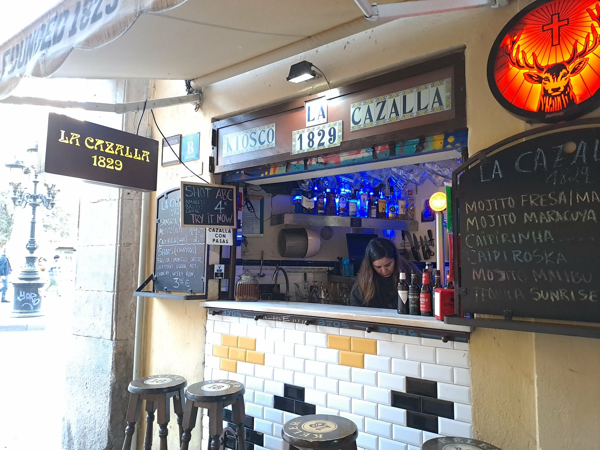

# Žádný chaos ani no-go zóny. Španělsko a jiná tvář migrace

BARCELONA, RAVAL. Stačí ujít pár kroků od La Rambly a člověk je v úplně jiném světě – a přitom pořád v centru města.

Hned u vstupu do čtvrti je můj oblíbený bar. Tři stoličky, malý výdejní pult, žádný designový podnik. Chodím sem pravidelně a ráda. Vermut tu mají výborný, levný a hlavně je tu na co koukat. Dám si sklenku, mističku nakládaných oliv a pozoruju ruch kolem. Vedle mě starší Katalánec, za mnou turisté, kolem procházejí lidé s nákupem.

Normální město.

O pár kroků dál Rambla del Raval. Dětské hřiště, lavičky, lidé posedávají, povídají si. Turisté si fotí obří kočku od Botera. Kolem bary a restaurace, kam chodí místní – ne „odvážlivci", ale běžní lidé.

Ulice jsou živé. Malé obchody, večerky, halal řeznictví, ale i klasické španělské bary. Muži v šalvár kamíz, ženy v hidžábech – ale rozhodně ne většina. Ten mix je viditelný, ale není oddělený.

Raval není no-go zóna ani „cizí svět". Je to normální čtvrť. O něco špinavější (i když poslední dobou si dala barcelonská radnice velkou práci a Raval dost vyčistila) a občas hlučnější. Je to místo, kam lidé chodí – na jídlo, na drink, na procházku.

---

Podobný pocit mám i v madridském LAVAPIÉS – jen s jinou atmosférou.

Tady je víc cítit Afrika a Latinská Amerika. Restaurace s etiopskou, senegalskou nebo bangladéšskou kuchyní nejsou exotika, ale běžná součást čtvrti. A hlavně: chodí tam Madriďané.

Lavapiés žije večer. Náměstí plná lidí, skleničky vína, tapas, hluk, smích. Vedle sebe místní i migranti. Děti, páry, skupiny přátel. Turisté, kteří sem přišli právě proto, že to „žije".

Stačí projít pár ulicemi – barevné fasády, otevřené podniky, lidé sedící venku. Atmosféra, která je spíš středomořská než „problémová". Není náhoda, že Lavapiés byl v roce 2019 zařazen mezi DESET NEJLEPŠÍCH ČTVRTÍ NA SVĚTĚ.

I tady jsou ženy v hidžábech, muži z Afriky, lidé z různých koutů světa. Ale nejsou oddělení. Jsou součástí jednoho prostoru.

---

A pak je tu ještě jedno místo, kde by člověk čekal pravý opak: ALGECIRAS.

Přístav na jihu Španělska, pár kilometrů od Afriky. Jedna z hlavních bran migrace do Evropy. Místo, které by mělo – podle našeho zjednodušeného vnímání – být špinavé, chaotické a samý problém.

## Realita je o dost jiná

Algeciras není žádná frontová linie. Je to normální město. Ano, víc policie, víc kontroly, občas témata jako pašování nebo drogy (to způsobuje nejen blízkost Afriky, ale především blízkost Gibraltaru). Ale jinak? Kavárny plné lidí, běžný život, žádný pocit kolapsu.

---

Tady nám to začíná „nesedět".

Protože když člověk sleduje českou debatu, má pocit, že západní Evropa je plná nebezpečných čtvrtí, kam se nechodí. Afrických gangů. Muslimských fanatiků. „No-go zón".

Ve Španělsku jsem nic takového nezažila.

To neznamená, že problémy neexistují. Ale realita vypadá jinak.

Ano, v Ravalu potkáte hodně lidí z Pákistánu nebo Bangladéše. Ale právě to je extrémní koncentrace, která vytváří zkreslený dojem. V celém Španělsku tvoří migranti z muslimských zemí mimo Afriku jen malý zlomek populace.

---

Celkově ve Španělsku žije asi 10 milionů lidí narozených v zahraničí – zhruba pětina populace. Největší skupiny ale nejsou ty, které si většina lidí představí. Dominují Latinská Amerika, Evropská unie a Maroko. Asie je menší segment. A mediálně nejviditelnější skupiny jsou ve skutečnosti menšinové.

Tohle není detail. To je zásadní rozdíl mezi realitou a představou.

---

Ještě v roce 1975 bylo Španělsko prakticky bez migrantů. Všechno, co vidíme dnes, vzniklo během posledních třiceti let.

Nejvíce pak během několika málo let na začátku tisíciletí.

Mezi lety 2000 a 2005 přišly do země miliony lidí. Většinou proto, že se jejich vlastní země hroutily. Ekvádor, Argentina, Kolumbie. K tomu otevření pracovního trhu pro Rumuny a dlouhodobý tlak z Maroka.

Každá migrační vlna měla konkrétní důvod.

---

Tihle lidé z naprosté většiny nepřišli sedět doma.

Ve Španělsku dnes pracuje zhruba dvě třetiny migrantů (z celkového počtu, do kterého patří děti, studenti a staří lidé). Jejich ekonomická aktivita je vyšší než u domácí populace. Najdete je ve stavebnictví, gastronomii, turismu, zdravotnictví, péči. Často dělají práci, o kterou místní nestojí. Někteří podnikají.

---

Ano, migranti jsou v kriminalitě velmi mírně nadreprezentováni. To je fakt. Ale většinou jde o drobnou kriminalitu – krádeže, kapsářství, drogy. Ne o kolaps bezpečnosti.

Španělsko má jednu z nejnižších úrovní násilné kriminality v Evropě.

---

Migranti tu nejsou izolovaní v uzavřených enklávách. Jsou promíchaní s místní populací. Pracují, bydlí a fungují ve stejném prostoru.

Raval ani Lavapiés nejsou ideální. Ale nejsou to „zakázané zóny".

Další důležitá věc: Španělsko není tranzitní země. Většina migrantů zde zůstává. Jazyk, práce a možnost legalizace dávají smysl zůstat.

---

A stát to ví.

Španělská politika není postavená na tom, jak migraci zastavit. Snaží se ji řídit. Legalizace, zapojení do práce, integrace. Ne ideologie, ale pragmatismus.

Protože Španělsko má problém, který se nedá obejít: demografii.

Porodnost kolem 1,1 dítěte na ženu. Stárnoucí populace. Bez migrantů by země nedala. Už dnes má zhruba čtvrtina nově narozených dětí matku narozenou v zahraničí.

Migrace není jen politické téma. Je to nutnost.

---

To ale neznamená, že všechno funguje bez problémů. Napětí existuje. Část společnosti si myslí, že je migrantů příliš mnoho. Existují problémy s bydlením, lokální kriminalitou nebo nezaměstnaností u některých skupin.

Ale nejsou to problémy, které by rozkládaly stát, což je naprosto zásadní.

---

Španělsko ukazuje, že migrace nemusí vypadat tak, jak si ji často představujeme.

Je méně dramatická, než se zdá. Více promíchaná. A z velké části postavená na práci.

Že tomu tak je si nejlépe můžete ověřit sami. Až pojedete do Barcelony, zajděte do Ravalu, stojí to za to. A být v Madridu a nezajít si večer do Lavapiés je jako byste tam nebyli.

