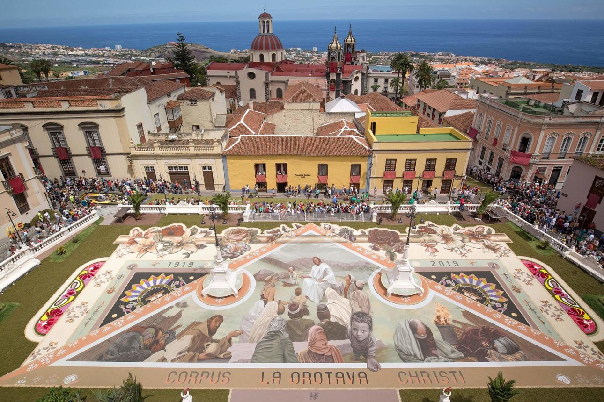
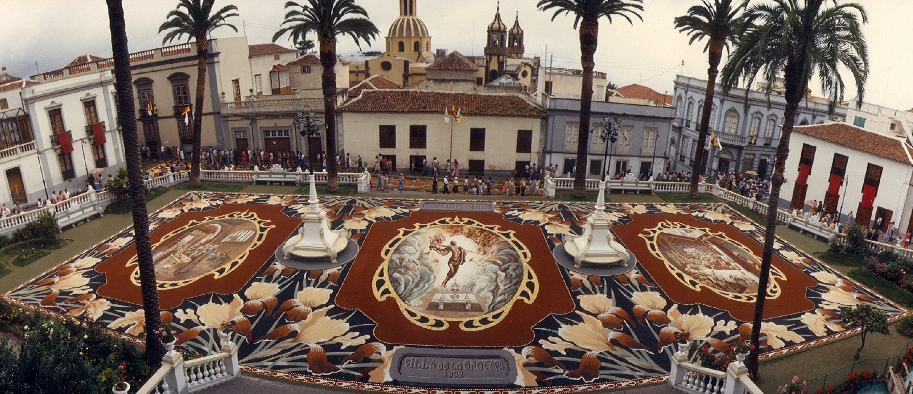

# Corpus Christi v La Orotava

*Je 4. června. Ve Španělsku se slaví Corpus Christi, svátek božího těla.*

Kdysi jsem žila rok na Tenerife. Právě jsem dokončila jednu školu, byla ve čtvrtém ročníku druhé, měla rozeslané životopisy do všech českých cestovek a čekala, jestli se některá ozve. Ozvala se. Hledali delegátku pro české i německé klienty na Tenerife. Na rok.

Mělo to jediný háček. Požadovali řidičský průkaz.

Ten jsem tehdy neměla.

Následoval rychlokurz v Praze, zkoušky a během několika týdnů jsem držela v ruce úplně nový řidičák. Krátce nato jsem přistála na jižním letišti Tenerife, převzala v půjčovně Opel Corsu a vyrazila po dálnici směrem na sever ostrova.

Celá jsem se klepala. Byla to moje první jízda po dálnici v životě.

Po asi třiceti kilometrech se z auta začalo kouřit. Vyděšeně jsem zastavila u krajnice. Co teď? V panice jsem auto nechala stát a vydala se pěšky hledat pomoc. Kdo někdy jel po dálnici kolem Tenerife, ten si teď asi zoufale klepe na čelo.

Po několika kilometrech jsem narazila na benzinku. Jeden ze zaměstnanců se nade mnou slitoval, dojel se mnou k autu, podíval se na něj a s úsměvem mi vysvětlil, že bývá dobré jezdit s uvolněnou ruční brzdou.

Rok na Tenerife se nakonec stal velkou prověrkou mých schopností. Nejen řidičských. Postupně jsem si ostrov zamilovala a dodnes na něj vzpomínám jako na jedno z nejkrásnějších období svého života.

Jedním z nejsilnějších zážitků byla příprava na Corpus Christi v městečku La Orotava.

## Celé město voní květinami

Několik dní před slavností se město začne měnit.

Večer co večer se otevírají dílny, kde se scházejí místní obyvatelé. Především ženy, ale nejen ony. Sedí u dlouhých stolů a hodiny otrhávají okvětní lístky z růží, karafiátů, hortenzií, gerber, kopretin, buganvílií a dalších květin. Jiní připravují listy kapradin a další zeleň.

Strávila jsem s nimi 2 večery uprostřed omamné vůně květin, s rukama zbarvenýma od pylu a plnila s nimi proutěné koše – do každého jeden odstín. Povídalo se, popíjelo, smáli jsme se až pozdě do noci.

Pak jsem šla spát.

Když jsem se ráno vrátila, náměstí z včerejšího večera se proměnilo ve velké plátno. Na dlažbě předkreslené obrazce, které lidé začínali postupně vyplňovat květinami a barevnými písky.

## Tradice stará skoro 200 let

Corpus Christi neboli Slavnost Těla a Krve Páně patří k nejvýznamnějším katolickým svátkům. Ve Španělsku se slaví už po staletí, ale tradice květinových koberců v La Orotavě je mladší.

Za její počátek je považován rok 1847. Tehdy místní šlechtična Leonor del Castillo ozdobila prostor před svým domem květinami pro průchod procesí. Její nápad se zalíbil natolik, že ho začali napodobovat další obyvatelé města.

Z jediné ozdobené ulice vznikla tradice, která dnes přitahuje návštěvníky z celého světa.

## Tisíce květin a stovky dobrovolníků

Přípravy začínají týdny před samotnou slavností.

Je potřeba nasbírat a nakoupit obrovské množství květin. Dobrovolníci pak dlouhé hodiny oddělují okvětní lístky od stonků a třídí je podle odstínů.

Na výzdobu ulic padnou desetitisíce květů a celé tuny rostlinného materiálu.

Do příprav se zapojují celé rodiny. Rodiče, děti i prarodiče. Mnozí se podílejí na tvorbě koberců celý život a své zkušenosti předávají dalším generacím.

## Koberec ze sopky

Nejslavnější dílo v La Orotavě ale vůbec není z květin.

Na náměstí Plaza del Ayuntamiento před radnicí každoročně vzniká monumentální obraz o rozloze téměř 900 metrů čtverečních. A ten je vytvořen z materiálu, který pochází ze svahů sopky Teide.

Jsou to barevné písky – rozdrcené vulkanické horniny a minerály z oblasti Las Cañadas pod Teide.

Černé odstíny pocházejí převážně z čedičů. Červené a okrové barvy vytvářejí horniny bohaté na oxidy železa. Světlé odstíny dávají vulkanické tufy a popely. Po rozdrcení a prosátí vznikne jemný materiál připomínající barevný písek.

Příprava centrálního koberce trvá několik týdnů. Materiál se musí vytřídit, rozdrtit a prosít na různé frakce. Na výsledném díle pracují desítky zkušených tvůrců, kterým se říká alfombristas.

## Krása na jediný den

Tenhle svátek je nádherný a … pomíjivý.

Stovky lidí pracují celé týdny. Vytvoří nádherné obrazy z květin a vulkanických písků. A pak městem projde procesí.

Během několika hodin začnou koberce mizet pod kroky účastníků.

To, co vznikalo týdny, zmizí během jediného dne.

A přesto se další rok začne znovu.

## Kde ještě najdete květinové koberce

Tradice květinových koberců není výsadou Tenerife. Krásné slavnosti Corpus Christi můžete vidět také v katalánském Sitges, v Toledu, Granadě nebo Seville. Nikde jinde ale nenajdete tak jedinečné spojení květinového umění a vulkanické krajiny jako právě v La Orotavě, kde se na jeden den promění v umělecké dílo nejen město, ale i samotná sopka Teide.

