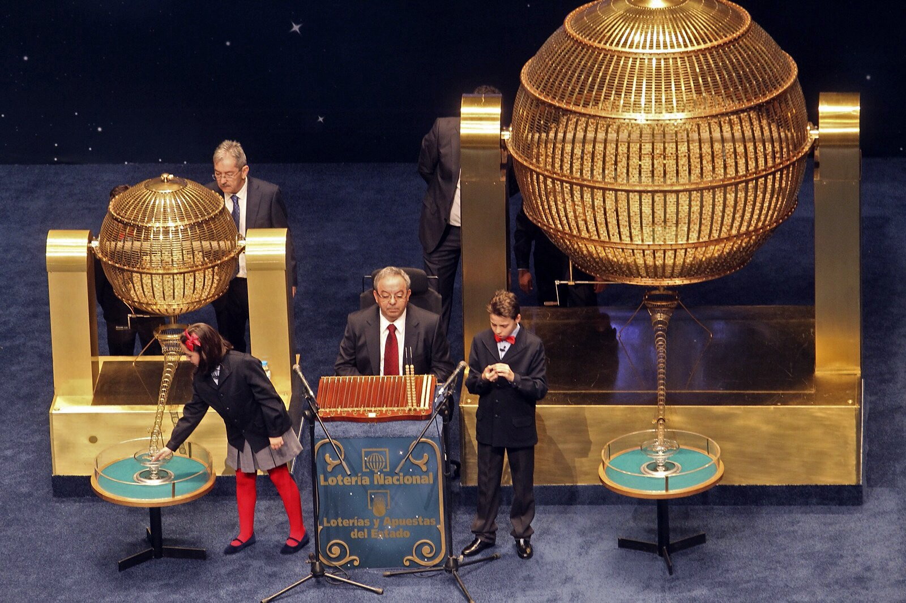
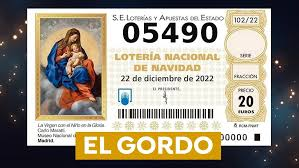
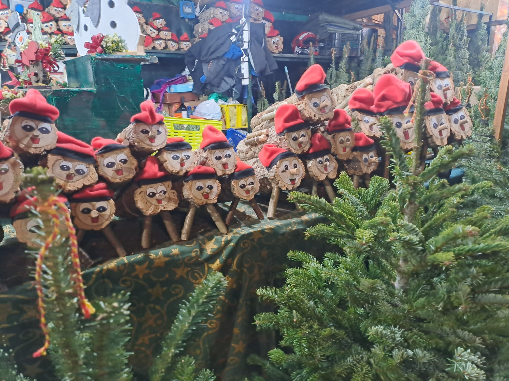
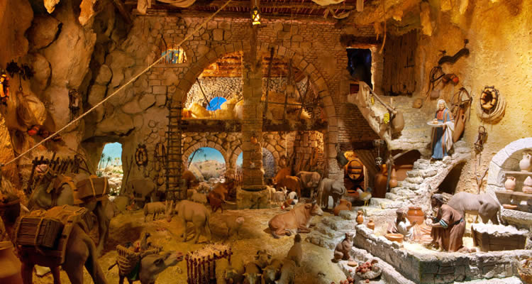
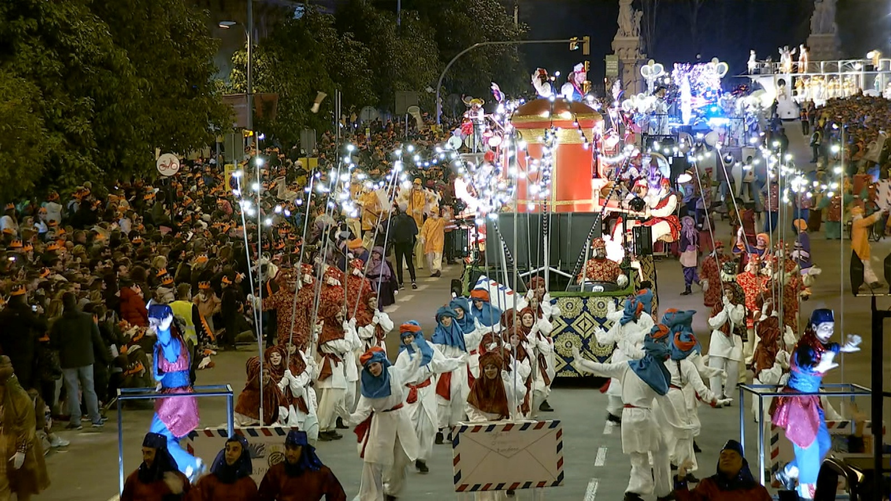

# Katalánské Vánoce: od Tlusťocha po Tři krále

Katalánské Vánoce nejsou rozhodně jen o jídle. Nejsou ani přehnaně zbožné, ani přehnaně sentimentální. Jsou praktické, symbolické a často překvapivě staré. Mísí se v nich křesťanství s předkřesťanskými rituály, rodinné tradice s moderním tlakem konzumu a vážné symboly s typickým katalánským humorem. Právě tahle kombinace z nich dělá Vánoce, které nejsou „na efekt", ale skutečně žité.

Pojďme si je projít tak, jak během svátků skutečně přicházejí — od velké prosincové loterie až po Tři krále.

## Vánoce začínají Tlusťochem: loterie El Gordo

Španělská vánoční loterie El Gordo není jen losování čísel. Je to společenská událost, tradice starší než většina moderních států a emoce, které každoročně sledují miliony lidí. Jak vznikla, jak funguje a proč kvůli ní lidé cestují přes půl Španělska?

El Gordo je **největší loterie na světě** podle celkového objemu vyplacených výher. Každý rok se v El Gordu rozdělí zhruba 2,5 miliardy eur. To je víc než u jakékoli jiné loterie na světě – včetně amerických.

První losování proběhlo už v roce 1812, uprostřed války proti Napoleonovi. Cílem bylo získat peníze do státní pokladny. Od té doby se z loterie stal národní rituál, který přežil monarchii, republiku, diktaturu i demokracii. Název „El Gordo" (Tlusťoch) označuje hlavní výhru, nikoli samotnou loterii.

### Jak to funguje

Losování se koná vždy 22. prosince v 9:00 ráno a trvá několik hodin. Probíhá v národním divadle **Teatro Real** v Madridu a má přísná pravidla:

- V osudí je 100 000 čísel (00000–99999)
- Každé číslo existuje v mnoha sériích
- Základní jednotkou není celý los, ale *décimo* (desetina losu)
- Cena jednoho décima je 20 €

Díky tomu si lidé často kupují jen část čísla a výhru pak sdílí – s rodinou, kolegy, sousedy nebo celou vesnicí.

### Děti, které vyzpívají výherní čísla

Jedním z nejikoničtějších momentů jsou děti z madridské základní školy Colegio de San Ildefonso, které zpívají vylosovaná čísla a výhry. Je to tradice, která sahá až do 18. století. Zpěv je přesně daný, monotónní a okamžitě rozpoznatelný. Pro Španěly je to zvuk začátku Vánoc. Mnoho lidí má losování puštěné jen jako kulisu, podobně jako pohádky u nás.

Jedno z minulých losování můžete zhlédnout zde: <https://www.youtube.com/watch?v=3OmetMj4VcU>

### Kolik je ve hře – a kolik lidí vyhrává?

El Gordo (hlavní výhra) činí 4 miliony € na celé číslo, tj. 400 000 € na jedno décimo. Výherních je více než 15 000 čísel, vyhrává zhruba každý čtvrtý los. Typické jsou menší, ale časté výhry, proto Španělé říkají:

> „Nejde o to vyhrát hodně, ale vyhrát společně."

V kancelářích se přestává pracovat, v barech běží přímý přenos a rodiny sledují losování doma od stolu nebo z gauče. Jakmile padne „jejich" číslo, šampaňské teče proudem. A když nepadne? „Aspoň zdraví... a že to zkusíme zase příští rok." 🙂

Ve Španělsku existuje i loterijní turistika – lidé cestují do míst „která nosí štěstí". Nejslavnějším je katalánské městečko Sort: jeho jméno znamená „štěstí" (v katalánštině). Nachází se zde slavná loterijní kancelář La Bruixa d'Or. Každý rok sem míří tisíce lidí koupit si los „pro jistotu". Tlusťoch tu sice nikdy nepadnul, ale opakovaně se tu prodávají losy, které přinesly vysoké výhry. Paradoxně právě to živí jeho legendu ještě víc – lidé tam jezdí „pro štěstí", ne proto, že by tam statisticky vyhráli víc. Je to typický příklad španělské loterijní mentality: rituál, naděje a atmosféra jsou důležitější než matematika.

## Caganer a Tió de Nadal: upozornění, tato kapitola obsahuje kadění. A tradici 🙂

Aneb dárky nemusí nikdo nosit, stačí když se najde někdo, kdo je vykadí. Na fotkách níže vidíte dvě největší katalánské vánoční hvězdy: **Caganera a Tió de Nadal**.

První je nenápadná figurka v betlému, která si v koutě dřepne se spuštěnými kalhotami a dělá, co musí. Druhý je usměvavé polínko s čepicí, které děti několik dní krmí... aby jim pak na Štědrý den **vykakalo dárky**.

Zní to absurdně? Pro Katalánce je to naprosto normální tradice. Caganer symbolicky „hnojí půdu" a přináší **plodnost, hojnost a štěstí do dalšího roku** – betlém bez něj je prý recept na smůlu. Tió de Nadal naopak rozdává sladkosti a drobné dárky hned teď, ovšem až poté, co ho děti pořádně zmlátí klackem a zazpívají mu. Ano, i tohle je výchova.

Obě postavičky spojuje stejná myšlenka: **co vyjde ven, přináší dobro**. V katalánské kultuře není kakání tabu, ale zdroj života, úrody a prosperity. A taky připomínka, že si jsou všichni rovni – pastýři, králové, politici... i oni musí občas do dřepu.

Takže až vám budou katalánské Vánoce připadat „divné", vězte, že jsou jen **upřímně lidské**. A ano – tahle tradice funguje už stovky let. 💩🎄

## Katalánské Vánoce na talíři

Po letech strávených v Katalánsku člověk pochopí, že místní Vánoce se odehrávají hlavně u stolu. Nejde o to, kolik kdo upeče druhů cukroví, ale jak dlouho se u jídla sedí a s kým. Katalánské vánoční menu má jasná pravidla, která se příliš nemění. A právě díky tomu funguje už po staletí. Je ale i důkazem, že tradice se dají udržovat i bez stresu a nekonečného pečení. Stačí vědět, co má na vánočním stole skutečně své místo. Katalánské ženy totiž nemusí péct žádné cukroví – a vůbec jim to nevadí.

Vánoční stoly ovládají TORRONS, sladkost, která má blíž ke středověku než ke kuchařce našich babiček. Základní recept je jednoduchý a přitom geniální: mandle, med, cukr a bílek. Historicky torrons pocházejí z oblasti Středomoří a jejich výroba je spojována s arabským vlivem ve středověkém Španělsku. Nejslavnější jsou varianty Jijona (měkký, krémový) a Alicante (tvrdý s celými mandlemi), ale v Katalánsku se vyrábějí i místní verze, například v Agramuntu. Dnes existují torrons s čokoládou, pistáciemi, alkoholem nebo dokonce se solí – tradice se tu rozhodně nebojí inovací.

Zatímco sladké se jí celé svátky, hlavním jídlem Štědrého dne je ESCUDELLA I CARN D´OLLA. Jde o sytou polévku, která připomíná naši silnou vývarovou klasiku, ale v katalánském měřítku. Největší pozornost budí GALETS – obří mušlovité těstoviny, do kterých by se klidně vešla polovina lžíce. Vývar se vaří z několika druhů masa, zeleniny a klobás a má zasytit celou rodinu na dlouhé hodiny. Nejde o lehké jídlo, ale o symbol hojnosti a společného stolování.

Sladký vrchol Vánoc ale přichází až se svátkem Tří králů v podobě ROSCÓ DE REIS. Je to kruhový koláč zdobený kandovaným ovocem a uvnitř skrývá dvě překvapení. Figurka znamená, že se stáváte králem dne, fazole naopak rozhoduje o tom, kdo zaplatí koláč příště. A ne, na věk ani výmluvy se nehraje :-)

 

## Zdraví a peníze — obojí je důležité

Vánoční přání „Salut i força al canut" shrnuje katalánský pohled na svět s odzbrojující přímostí. Canut býval kožený měšec nebo rulička, kterou si lidé nosili u pasu či schovávali pod oblečením. Sloužil k ukládání mincí a drobných cenností v době, kdy kapsy neexistovaly a banky byly vzdálenou představou. Přát někomu „sílu do canutu" tedy znamenalo přát mu, aby jeho měšec byl těžký, plný a odolný – zkrátka aby vydržel a nebyl prázdný. Vánoce byly tradičně okamžikem bilancování a přání prosperity do dalšího roku. Katalánci se nikdy netvářili, že peníze nejsou důležité. Naopak: zdraví a hmotné zajištění patří k sobě a je naprosto v pořádku to říct nahlas.

## Betlémy nejen jako biblická scéna, ale i mapa světa

Betlémy, katalánsky pessebres, jsou v Katalánsku všudypřítomné a často monumentální. Nejde o jednu scénu, ale o celý model světa, kde se biblický příběh odehrává uprostřed katalánské krajiny. Hory připomínají Pyreneje, domy vypadají jako místní statky, lidé pracují, perou prádlo, pasou dobytek. Betlém se během svátků postupně rozšiřuje a dolaďuje, někdy až do Tří králů. Jeho součástí je i caganer, kterého už známe. V moderních verzích se objevují i aktuální osobnosti, což ukazuje, že tradice není zkostnatělá, ale neustále reaguje na současnost.

## Když se Vánoce zapalují ohněm

V horských oblastech Pyreneje mají Vánoce zcela jinou podobu než ve městech. V obcích Bagà a Sant Julià de Cerdanyola se na Štědrý den slaví FIA-FAIA, rituál s kořeny sahajícími pravděpodobně až do předkřesťanských slunovratových obřadů. Po západu slunce se na horách zapálí oheň, z něhož se zapalují pochodně z pryskyřičného dřeva. Ty se pak snášejí do vesnice, kde s nimi lidé zapalují další ohně. Účastní se téměř všichni obyvatelé – stovky lidí v komunitách o několika tisících obyvatel. Oheň tu není dekorací, ale symbolem ochrany, světla a kontinuity. Teprve když plameny dohoří, nastává klid, zpěv a skutečný začátek Vánoc.

## Dárky až v lednu a čekání jako součást svátků

Hlavní katalánské rozdávání dárků přichází až 6. ledna, kdy je přinášejí Tři králové – Els Reis Mags. Vánoce tu nejsou jedním večerem, ale dlouhým obdobím, které vrcholí až po Novém roce. Večer 5. ledna patří průvodům Cavalcada de Reis, které mají v Katalánsku masový charakter. V Barceloně se jich účastní statisíce lidí a Tři králové projíždějí městem v promyšlené choreografii (velbloudi bývají součástí průvodu celkem často). Děti píší dopisy, chystají vodu pro velbloudy a učí se čekat – což bylo kdysi považováno za přirozenou součást výchovy. Vlivem globalizace dnes mnoho rodin přidává menší dárky už na Vánoce, ale Tři králové zůstávají symbolem skutečného konce svátků i jejich hlavního smyslu.

 

## Vánoce, které se nepředstírají

Katalánské Vánoce jsou především hodně autentické. Přání plné peněženky, dárky až v lednu, betlémy jako obraz světa a ohně zapalované v horách – to všechno ukazuje, že tradice tu nejsou muzeálním exponátem, ale živou součástí života. Katalánci Vánoce nepředstírají. Prožívají je po svém. A možná právě proto dávají tak dobrý smysl.
