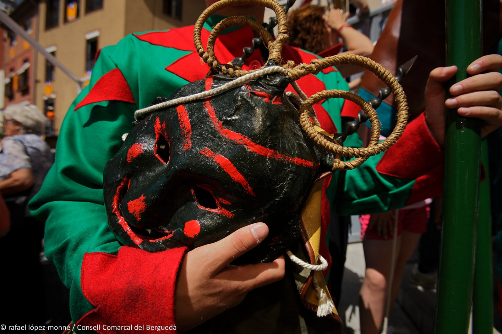
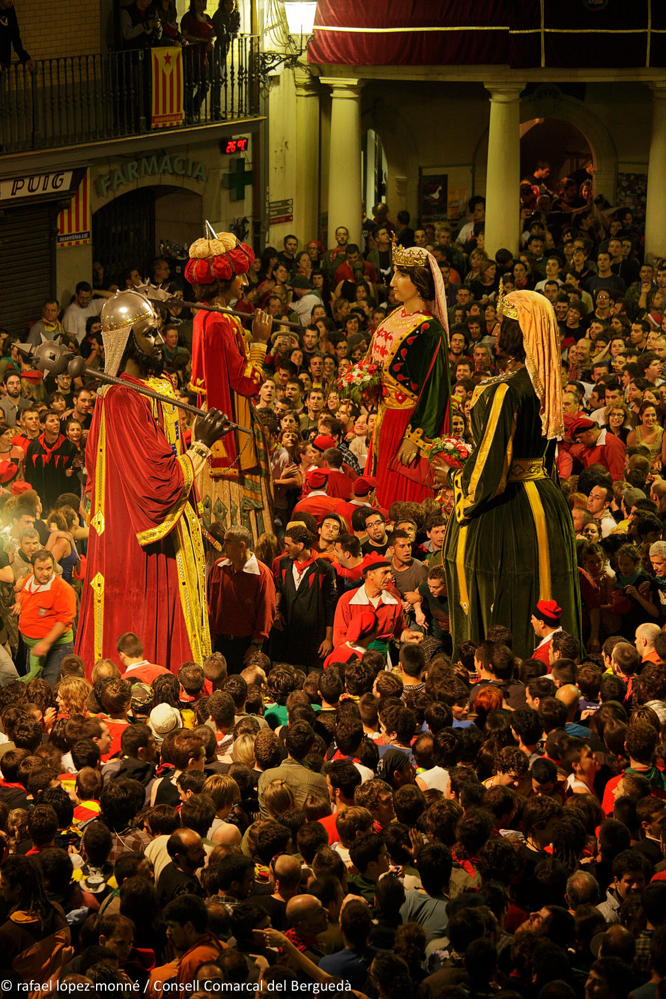
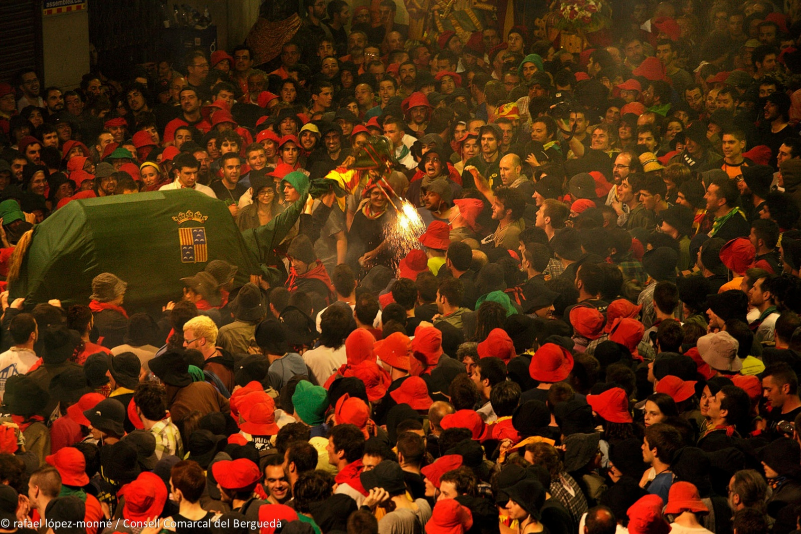
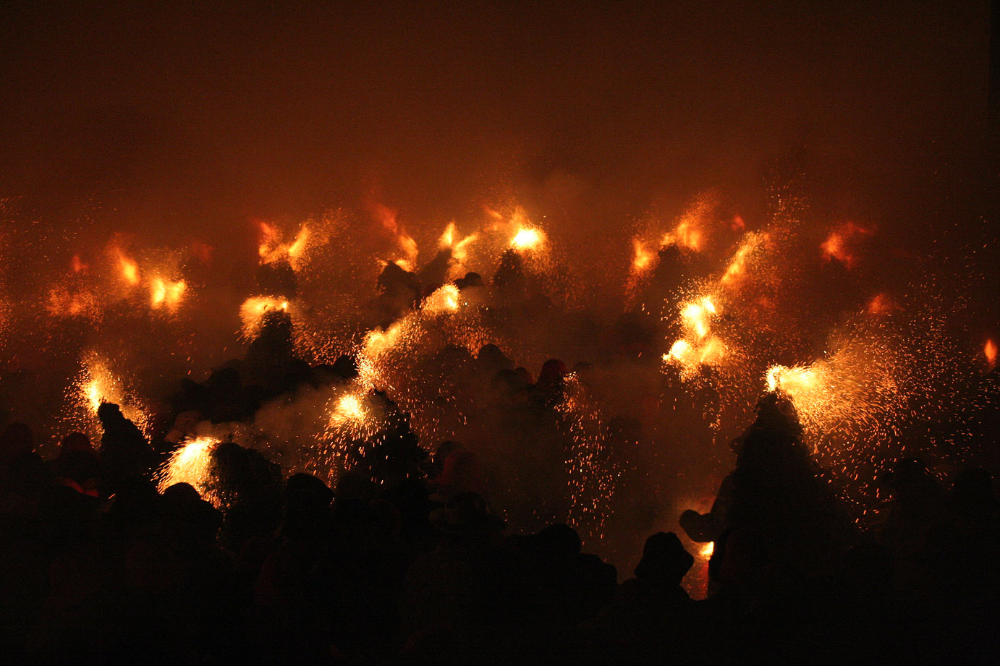
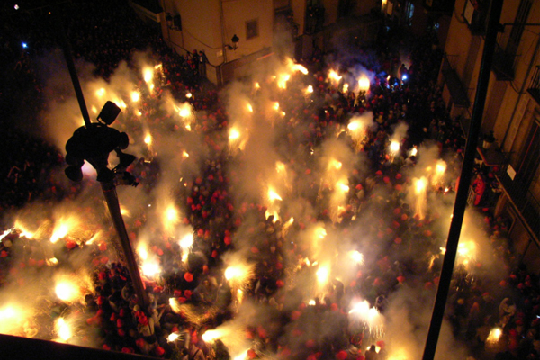

# La Patum – ohně, ďáblové a Boží tělo

*Dnes (4. června) v městečku Berga vrcholí jedna z nejstarších tradic Evropy: La Patum de Berga.*

La Patum je jedna z hodně zajímavých tradičních slavností Španělska.

Koná se v městě Berga, asi 100 km severně od Barcelony na úpatí Pyrenejí.

Nejde o folklorní festival ani historickou rekonstrukci. Místní ji berou jako součást své identity. Mnoho rodin se účastní po generace a některé role se dědí z otce na syna.

V roce 2005 byla slavnost uznána UNESCO jako Mistrovské dílo ústního a nehmotného dědictví lidstva a v roce 2008 byla zapsána na Reprezentativní seznam nehmotného kulturního dědictví lidstva.

## Už skoro 600 let

Podle dochovaných zmínek se poprvé v Berze slavila v roce 1454, ale nejspíš bude o dost starší. Některé postavy máme doložené ze 16., jiné ze 17. století. Je jednou z nejstarších nepřetržitě slavených lidových slavností v Evropě.

## Co to Patum je

Původně šlo o náboženské procesí Corpus Christi (Boží Tělo).

Ve středověku byla většina obyvatel negramotná, a tak církev používala různé divadelní výjevy, které lidem názorně vysvětlovaly biblické příběhy.

Do procesí se postupně přidávali ďáblové, andělé, draci, obři, Maurové i křesťanští rytíři.

Časem se staly populárnější než samotné procesí a začaly žít vlastním životem. Z náboženské slavnosti se postupně stala směs středověkého divadla, pohanských ohňových rituálů, katolické symboliky a lidové zábavy.

## Pohanské prvky

Těch je tu spousta: s velkou pravděpodobností slavnosti navazují na mnohem starší oslavy letního slunovratu a kult ohně.

Církev tyto zvyky nezrušila, ale začlenila je do oslav Corpus Christi.

Proto tu dnes vedle křesťanských oslav hoří ohně, pobíhají tu démoni a příšery, je slyšet bubny, dav rituálně tancuje – všechno to jsou prvky předkřesťanských oslav.

## Jak vznikl název

Španělé se s tím moc necrcají: zvuk bubnu slyší jako „pa-tum, pa-tum, pa-tum" – a odtud se postupně ujalo označení celé slavnosti.

## Kdy se koná

Každý rok během týdne svátku Corpus Christi.

## Kolik lidí přijíždí

Přesná čísla se liší podle roku, ale během hlavních dnů se do města sjíždějí desítky tisíc lidí a historické centrum bývá doslova přeplněné.

## Salt de Plens – šílenství vrcholí

Představte si malé středověké náměstí.

Zhasnou světla.

Náměstí se naplní tisíci lidí.

Najednou se objeví desítky démonů pokrytých pyrotechnikou.

Všechny zápalnice se zapálí současně.

Během několika sekund se celé náměstí promění v moře ohně, kouře, jisker, bubnů a křiku a tisíce lidí při tom všem tančí.

Tomuto okamžiku se říká Salt de Plens a je považován za jednu z nejintenzivnějších lidových slavností v celém Španělsku.

## Zajímavost

Přestože jde o slavnost plnou ohně, místní do ní chodí i s dětmi.

Existuje dokonce samostatná Patum Infantil, kde mají děti vlastní průvod, vlastní postavy a vlastní „malou Patum".

To krásně ukazuje, že pro obyvatele Bergy nejde o turistickou atrakci, ale o tradici, která se předává z generace na generaci.
