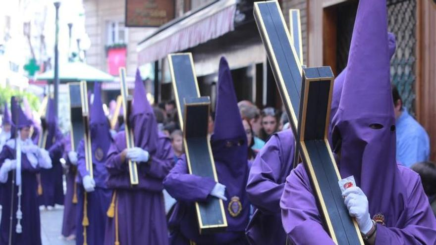
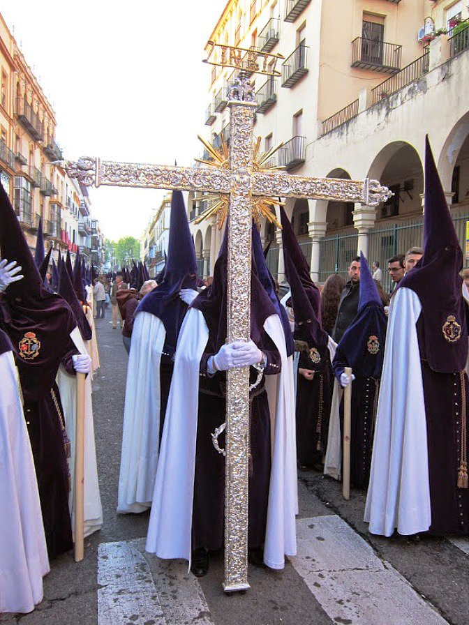
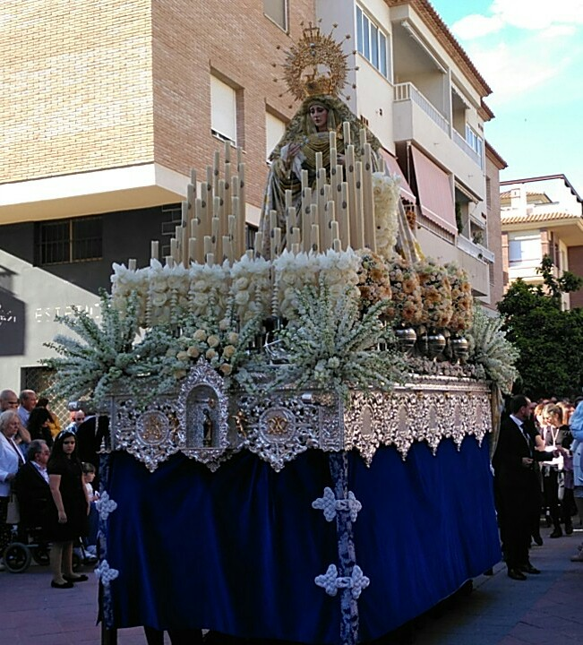
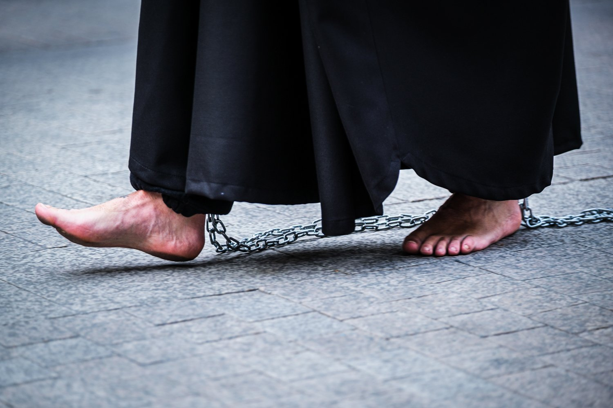
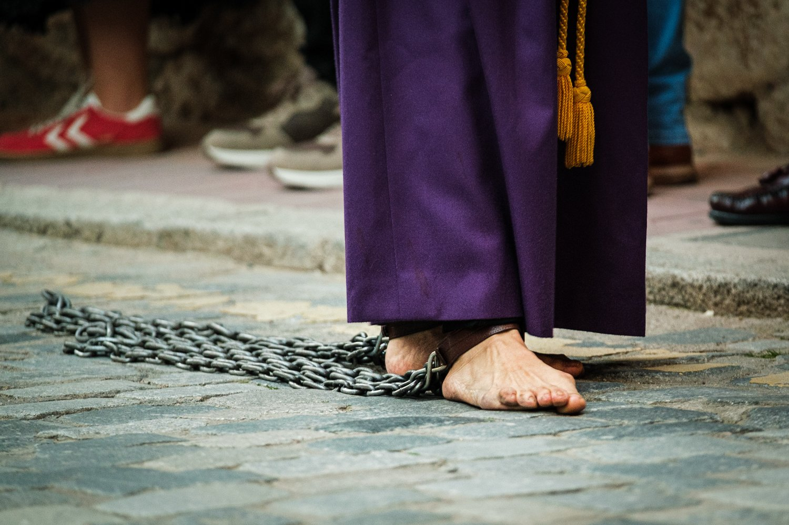

# Svaté pondělí – Lunes Santo: stokilové kříže na zádech a hodiny procesí bosky

Po slavnostní Palmové neděli začíná ve Španělsku skutečná Semana Santa.

Na Lunes Santo vyrážejí do ulic první menší procesí jednotlivých bratrstev. Těm se tu říká *cofradías*.

Cofradías vznikaly už ve středověku, nejčastěji mezi 14. a 17. stoletím. Zakládaly je cechy, sousedské komunity nebo skupiny věřících. Původně pečovaly o nemocné, organizovaly pohřby a náboženské slavnosti. Postupně se z nich staly organizované spolky s vlastními stanovami, majetkem a dlouhou tradicí.

Dnes jich ve Španělsku existují stovky. Jen v Seville působí více než 60 takových bratrstev, v Málaze přes čtyřicet. Některé mají stovky členů, jiné tisíce. Členství se často dědí v rodinách a není výjimkou, že v jednom bratrstvu jsou tři generace.

Cofradías fungují celý rok. Scházejí se, plánují trasy procesí, opravují sochy, připravují hudbu a hlavně rozdělují role. Ty jsou přesně dané a pro mnoho členů velmi prestižní.

---

## Bosí kajícníci

Nejviditelnější jsou **kajícníci** – *nazarenos* v dlouhých hábitech a špičatých kápích (o těch si něco povíme zítra). Někteří jdou bosí. Je to forma pokání nebo osobního slibu.

**Bosí kajícníci mohou jít ulicemi i několik hodin.** Trasa procesí bývá dlouhá tři až 8 kilometrů a trvá čtyři až osm hodin. Dlažba je studená, někdy mokrá, a není výjimkou, že účastníci končí s puchýři a zraněními.

---

## Dřevěné kříže

Další **nesou dřevěné kříže**. Ty menší váží kolem 20 či 30 kilogramů, ale v některých městech existují i mnohem těžší. Není výjimkou kříž vážící **sto kilogramů** i více. Některé měří několik metrů a kajícníci s nimi procházejí ulicemi celé hodiny. Váha není soutěž. Je to osobní slib – takzvaná *promesa*. Lidé si zátěž volí dobrovolně a často ji opakují každý rok.

Kříž se nese pomalu, bez spěchu, v tichu. Někdy jej kajícník drží na rameni, jindy jej táhne po zemi. Po několika hodinách chůze bolí záda, ramena i ruce. Přesto se mnozí do procesí hlásí znovu.

---

## Costaleros pod nosítky

Nejtěžší úkol mají *costaleros* – muži ukrytí pod nosítky, kteří nesou obrovské sochy. Jedna konstrukce může vážit i více než tunu. Na jednom „paso" se podílí desítky lidí, kteří se střídají. I tak zůstávají pod konstrukcí dlouhé desítky minut v naprostém tichu. O nejznámějším costalero, Antoniovi Banderasovi, také budu ještě psát.

---

## Tradice, závazek a otázka cti

Cofradías si své aktivity financují samy – z členských příspěvků, darů i rodinných tradic. Účast v procesí navíc není zdarma. Členové si často pořizují vlastní oděv, který může stát stovky eur. Přesto je zájem obrovský.

Pro turisty je Semana Santa velkolepé divadlo. Pro členy cofradías je to ale osobní věc. Tradice, závazek a často i otázka cti.

A právě na Lunes Santo začínají do ulic vycházet první procesí, která ukazují, že Semana Santa není jen slavnost, ale živá tradice, kterou lidé ve Španělsku skutečně žijí.

