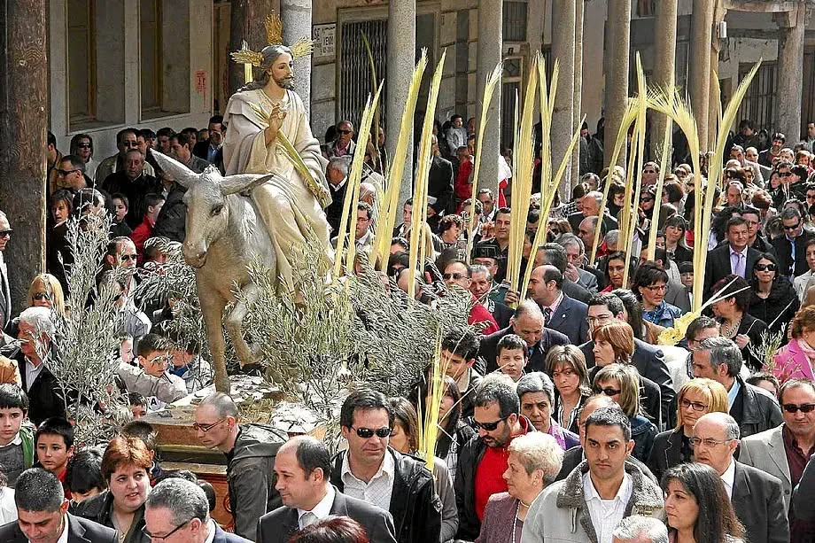
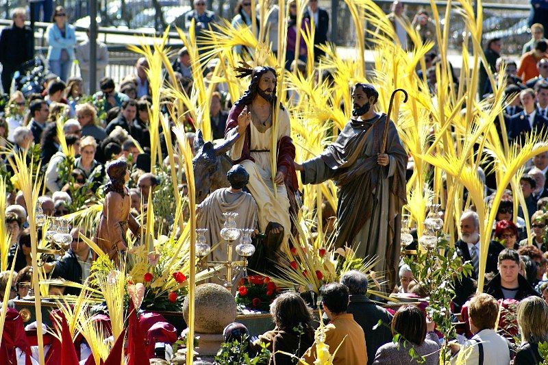

# Semana Santa – den první

## Začínáme Květnou nedělí – Domingo de Ramos

Atmosféra **prvního dne** je jiná než v dalších dnech. Je slavnostní, světlejší, méně dramatická. Ulice se plní lidmi, děti drží v rukou palmové ratolesti a města se pomalu připravují na nejintenzivnější týden celého roku.

Kořeny tohoto dne sahají do biblického příběhu, který je vlastně začátkem velikonočního dramatu.

Podle evangelia přijel Ježíš do Jeruzaléma krátce před svým ukřižováním. Nevjel jako král na koni, ale na obyčejném oslu – symbolu pokory. Lidé ho vítali jako Mesiáše. Prostírali na zem své pláště a mávali palmovými větvemi, což byl ve starověku znak úcty a vítězství. Volali „Hosanna" a oslavovali jeho příchod.

Je to paradoxní moment. Ten stejný dav, který ho vítal, bude o několik dní později volat „Ukřižuj ho".

Právě proto je Domingo de Ramos začátkem dramatického oblouku, který vrcholí Velkým pátkem.

---

## Palmové ratolesti v ulicích

Ve Španělsku se tento biblický příběh promítá do tradice, která je živá dodnes.

**Palmové ratolesti** – tj. *ramos* – si lidé většinou nekupují v kostele, ale na ulici. Už několik dní před Květnou nedělí se v centrech měst objevují stánky a malé trhy, kde se prodávají jednoduché palmové větve i dlouhé, zdobené palmy pro děti. V Andalusii jsou typické světlé, téměř bílé palmy, často velmi precizně pletené.

**Ramos se pak v kostele posvětí.** Tím ale tradice nekončí.

Mnozí si je odnášejí domů a zavěšují na balkony, dávají do oken nebo připevňují ke dveřím. Zůstávají tam často celý rok jako symbol požehnání a ochrany domácnosti. Ve španělských městech tak v těchto dnech uvidíte balkony ozdobené palmovými listy – nenápadný, ale velmi typický detail, který signalizuje, že Semana Santa začala.

Jedním z nejtypičtějších obrazů Domingo de Ramos jsou **děti s obrovskými palmovými listy**. V Andalusii je běžné, že tyto listy měří metr a půl, někdy i dva metry. Malé dítě s palmou větší než ono samo je scéna, kterou uvidíte v každém městě. Pro děti je to malý svátek – a často i tichá soutěž, kdo bude mít list nejvyšší.

Na rozdíl od dalších dnů Semana Santa není Domingo de Ramos tolik o pokání a utrpení. Je to den očekávání. První bratrstva vycházejí do ulic, ale hudba je ještě slavnostní, ne smuteční. Tuniky mají často světlejší barvy a atmosféra působí téměř radostně.

Je to také den, kdy si Španělé uvědomují, že začíná něco velkého. Města se začínají zaplňovat, bary jsou plné, lidé stojí na rozích ulic a čekají na první procesí. Ještě je světlo, ještě je teplo, ještě se mluví nahlas.

**Semana Santa právě začala.**

